# How to use CFG Megapack

Every CFG Megapack node takes a MODEL and gives back the same model with one stage of its guidance plan set. Chain
them between the model loader and the sampler; at every sampler step the stages run in a fixed order (when, weak
branch, combine, where, correct, govern, measure), whatever order the nodes sit in. A later node of a stage
replaces an earlier one, except Correct nodes, which stack. The sampler's cfg is the guidance scale `w` unless a
node sets its own `scale` (-1 means "use the sampler's cfg").

The words used below: `c` and `u` are the model's conditional and unconditional predictions at a step; plain CFG is
`u + w (c - u)`; the **guidance term** is how far guidance pushes past the conditional prediction,
`(w - 1)(c - u)` for plain CFG.

Contents: [the example workflows](#the-example-workflows) · [the stage nodes](#the-stage-nodes) ·
[the paper nodes](#the-paper-nodes) · [recipes](#recipes) · [troubleshooting](#troubleshooting)

## The example workflows

Open them from **Workflow > Browse Templates > Custom Nodes > comfy-cfg-megapack**, or drag a file from
`example_workflows/` onto the canvas. Each renders two images from one shared seed (the **Seed** node feeds both
samplers): plain CFG on the left branch, the variant on the right. The seed randomizes after each queue; set it to
fixed to compare settings on the same image (only the changed branch runs again).

| Workflow | What it compares | How to use it |
|---|---|---|
| CFG Megapack - stage chain AB | plain CFG against the whole chain of stage nodes; only the APG mix is on, the other stages are bypassed | select a stage node and press Ctrl+B to switch it on; the Plan Readout shows what is active |
| CFG Megapack - paper node AB | plain CFG against one paper node (APG) at cfg 14, where high-scale artifacts show | swap the APG node for any other paper node (double-click the canvas, type the paper's name) |
| CFG Megapack - your formula AB | plain CFG against a formula you type | edit the formula; see [Your Own Formula](#3-cfg-mix-your-own-formula) |
| CFG Megapack - pentachoron formula AB | plain CFG against the pentachoron formula | change `k = 1.0` in the first line: larger is closer to plain CFG |
| CFG Megapack - angle governor AB | plain CFG against the angle governor at 20 degrees, whole image | try 10-30 degrees, or unit = each pixel |
| CFG Megapack - negative vs null guider AB | ComfyUI's CFG guider against the positive/negative/null guider (Perp-Neg) | uses SamplerCustomAdvanced; the null prompt is the empty text |
| CFG Megapack - Anima stage chain AB | on Anima: plain CFG against the stage chain with the governor on (20 degrees) | Anima's loaders, shift 3, er_sde / simple, 40 steps, CFG 4.5, 1024 x 1024; the weak branch is preset to SEG |

For pixel-exact A/B pairs, queue once with any other seed after loading a model: ComfyUI's first sampling after a
model load rounds slightly differently from every later one.

## The stage nodes

### 1 CFG When: Schedule and Window

Sets how the scale changes over the run and where guidance is on.

| Input | What it does |
|---|---|
| shape | the schedule inside the window (table below) |
| start_percent, end_percent | the window, in ComfyUI's percent of the run: measured on the model's own noise schedule (shift-aware on flow models), so on karras-type schedules it is not the same as a share of the steps |
| outside | what happens outside the window: **no guidance** (the conditional prediction alone; the unconditional pass is skipped there), **base scale** or **fixed scale** (every other node still applies, only the scale changes), or **plain CFG at base scale** (the other nodes off) |
| outside_scale | the scale outside the window with the fixed-scale mode |
| floor | the scheduled scale never goes below this |
| shape_a, shape_b | shape parameters (-1 = the shape's default) |
| skip_uncond_outside | with outside = no guidance, skip the unconditional pass there (same image, faster) |

| Shape | Scale over the window (average kept at the base scale where noted) | Source |
|---|---|---|
| constant | the base scale | |
| linear_up, cosine_up | rising; average kept | Wang et al. 2024 |
| linear_down, cosine_down | falling; average kept | Wang et al. 2024 |
| v_shape, lambda_shape | down then up, or up then down; average kept | Wang et al. 2024 |
| tv_cfg | a triangle peaking at shape_a (0.5); normalized on the sampler's own steps | Jin et al. 2025 |
| beta_pdf | the base scale times a Beta(a, b) curve over the window | Malarz et al. 2025 |
| c2fg_exp | grows as exp(a (1 - t)), t the noise level (a = ln 2 doubles it) | Gao et al. 2026 |
| cads_ramp | zero at high noise, ramping to full between two noise levels (a = 0.6, b = 0.9) | Sadat et al. 2024 |

The shape runs from the window's first step to its last, so a cosine_down over 0 to 0.1 falls from its top to its
bottom inside that first tenth.

### 2 CFG Weak Branch: Perturbed Self-Attention

Runs one extra pass of the model on the positive prompt with some self-attention degraded, and guides away from it
(one extra model pass per step).

| Input | What it does |
|---|---|
| method | **pag**: identity attention, each token sees only itself (Ahn et al. 2024). **seg**: the queries blurred over the image (Hong 2024). **temperature**: flatter attention. **skip**: the self-attention sublayer adds nothing (the layer skip of STG, Hyung et al. 2025) |
| scale | add mode: result = combine + scale (c - perturbed); PAG's paper uses 3 |
| mode | **add on top of CFG**, or **replace the unconditional**: the perturbed prediction takes `u`'s place at the mix scale (the text-unconditional pass is then skipped, so guidance comes from the weak branch alone) |
| blocks | which self-attention blocks are perturbed (SDXL names). On Anima: middle = its two middle blocks (13 and 14 of 28), deep input = the first third, deep output = the last third, all = every block |
| blur_sigma | SEG: blur in latent pixels (Anima: tokens of its 2 x 2 patch grid; a 1024 image is 64 x 64); 100 = infinite, every query becomes the mean |
| temperature | temperature: the attention logits are divided by this |

On Anima only seg and skip run; pag and temperature stop with a message (its blocks take patches on the attention
inputs only, and a query temperature would be undone by the blocks' query normalization).

### 3 CFG Mix: Scale Rules

Rules that keep the guidance direction and change how far to go along it.

| Rule | Result | Knobs |
|---|---|---|
| standard | `u + w (c - u)` | |
| cfg_zero_star | `s u + w (c - s u)`, s the least-squares fit of u to c; the first steps can leave the latent unmoved (Fan et al. 2025) | zero_init_steps |
| power_law | the scale grows with the size of the difference: `1 + (w - 1) ||c - u||^alpha` (Lehman Pavasovic et al. 2025); retune w per model and resolution | power_alpha |
| magnitude_damped | the scale shrinks where the difference is large relative to u (MAMBO-G, Zhu et al. 2025) | damping_alpha |

### 3 CFG Mix: Direction Rules

Rules that change the direction of the guidance.

| Rule | What it does | Knobs |
|---|---|---|
| apg | splits `c - u` into its part along c and the rest, down-weights the first (eta), caps the norm, adds reverse momentum (Sadat et al. 2025; the paper form, one unit less guidance than ComfyUI's built-in APG) | eta, norm_threshold, momentum |
| tangential_damping | removes u's part off the direction shared with c (TCFG, Kwon et al. 2025) | |
| angle_limit | turns instead of extrapolating past a maximum angle (ADG, Jin et al. 2025) | max_angle_degrees |
| mahiro | blends toward the scaled conditional prediction by their similarity (ComfyUI Mahiro) | |

**space** (on every combine node): where the rule is computed. Linear rules give the same image in any space;
projections, caps and clips do not. **auto** uses the space the method was published in: noise for most, the
denoised image for APG and the angle rule; on flow models methods published on the noise run on the velocity.
The Adaptive Guidance paper node starts on the denoised image instead (its section says why).

### 3 CFG Mix: Your Own Formula

Type the guided prediction as a Python expression, or several lines that assign `result`.

| Variable | Meaning |
|---|---|
| `c`, `u` | the conditional and unconditional predictions, in the node's space |
| `w` | the scale after the When stage |
| `x` | the latent, `sigma` the noise level the sampler uses, `t` the noise level in [0, 1] (1 = noise) |
| `p`, `step`, `steps` | progress (0 at the first step, 1 at the last), the step index and count |
| `weak` | the weak branch's prediction when a weak-branch node is chained, else None |
| `flow`, `shift`, `t_raw` | flow models: True, the timestep shift s in `sigma = s t / (1 + (s - 1) t)` (Anima 3; Flux-type sampling reports exp(mu), the same curve), the unshifted time. SDXL: False, 1, t |
| `a_t`, `s_t` | `x = a_t x0 + s_t noise`: (1 - sigma, sigma) on flow models, (1, sigma) on SDXL |
| `space` | the node's space: 'x0', 'eps' or 'v' |
| `to_x0(a)`, `to_eps(a)`, `to_v(a)` | convert a prediction from the node's space; on flow models eps is the noise itself and v the velocity `noise - x0` |
| `from_x0(a)`, `from_eps(a)`, `from_v(a)` | the way back into the node's space |

Helpers (per image): `dot`, `norm`, `cos`, `proj(a, onto)`, `orth(a, onto)`, `std`, `mean`, `lowpass(a, sigma)`,
`highpass(a, sigma)`, `lerp`, and `clamp`, `where`, `sqrt`, `exp`, `tanh`, `sign`, `torch`, `math`. A formula may
import torch or numpy modules (`import torch.nn.functional as F`) and nothing else.

```
u + w * (c - u)                                     plain CFG
u + w * orth(c - u, c) + proj(c - u, c)             APG-like: full scale only off the conditional's direction
c + (w - 1) * (lowpass(c - u, 2) * 0.5 + highpass(c - u, 2) * 1.3)
u + (1 + (w - 1) * (1 - p)) * (c - u)               guidance that fades out over the run
u + (1 + (w - 1) * t_raw) * (c - u)                 fades with the unshifted time (flow models)
from_x0(to_x0(u) + w * (to_x0(c) - to_x0(u)))       plain CFG on the denoised image, whatever the node's space
```

A syntax error shows on the node when the graph is queued; a runtime error names the formula. Anima's latents
arrive as (batch, 16, height, width). `formulas/pentachoron.txt` is a longer example (paste it whole, space noise):
the aleph weighting on the 5 vertices of a regular pentachoron in every group of 4 channels; `k` sets how firmly
large pushes are limited (1e6 = plain CFG).

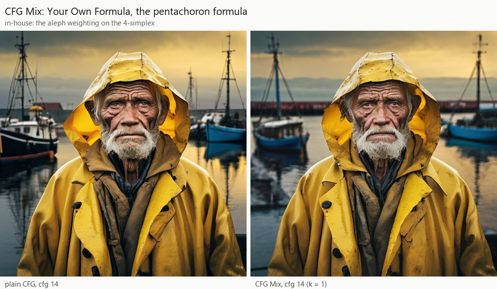

<sub>SDXL, cfg 14, k = 1; node graph: [docs/showcase/sdxl/Pentachoron.json](docs/showcase/sdxl/Pentachoron.json)</sub>

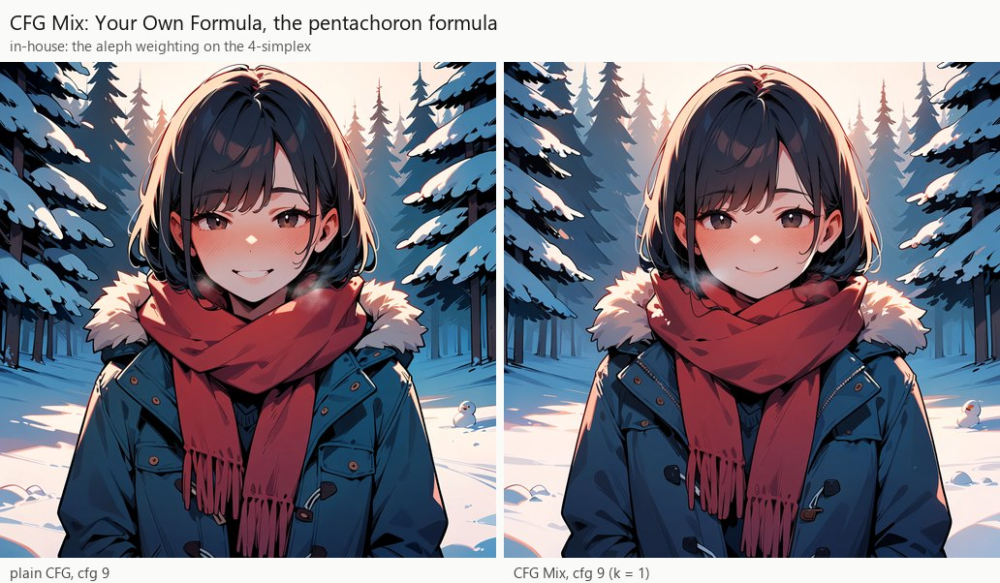

<sub>Anima (16 channels, four pentachora), cfg 9, k = 1; node graph: [docs/showcase/anima/Pentachoron.json](docs/showcase/anima/Pentachoron.json)</sub>

### 4 CFG Where: Frequency Bands

Splits the guidance term into low frequencies (layout, color) and high frequencies (detail) and scales each.
**method** gaussian (the low band is a blur of `blur_sigma` latent pixels) or fft (frequencies under `fft_cutoff`);
**low_multiplier** and **high_multiplier** scale the two parts (1 = unchanged, 0 = no guidance there). With plain
CFG this is frequency-decoupled guidance: each band's scale is `1 + multiplier (w - 1)`. Try low 0.5 and high 1.2
to keep detail while calming colors.

### 4 CFG Where: Region Mask

Scales the guidance term by a MASK: `inside_multiplier` where the mask is white, `outside_multiplier` where it is
black (1 = unchanged, 0 = the conditional prediction alone there), `feather` blurs the edge (latent pixels),
`invert` swaps the two. Use it to guide a subject hard and leave the background at the conditional prediction.

### 5 CFG Correct: Magnitude

Pulls the guided prediction's size back toward the conditional prediction's, against over-saturation. Chain several
and they apply in order.

| Method | What it matches | Source |
|---|---|---|
| rescale_std | the per-image standard deviation | guidance rescale, Lin et al. 2024 |
| norm_cap | shrinks the push until the norm is at most cap_ratio times the conditional's | PMC-CFG, Peng & Ma 2026 |
| channel_norm_match | each pixel's channel-vector length | CFGNorm (Qwen-Image) |
| energy_preserve | the total energy (sum of squares) | EP-CFG, Zhang et al. 2024 |
| percentile_rescale | each channel's spread, to what a lower mimic scale gives | mimic-scale thresholding (mcmonkey) and Imagen's dynamic thresholding |
| soft_clip | tone-maps large pushes (Reinhard curve) | ComfyUI's Reinhard tonemap |

**strength** blends the uncorrected (0) and corrected (1) result: the published forms use 0.7 for rescale_std and
1.0 for the rest.

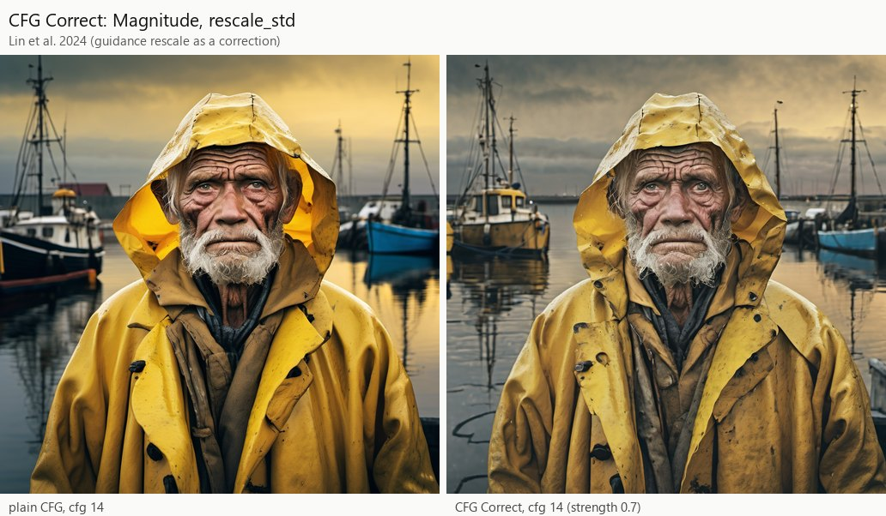

<sub>SDXL, cfg 14, rescale_std at strength 0.7; node graph: [docs/showcase/sdxl/CorrectRescale.json](docs/showcase/sdxl/CorrectRescale.json)</sub>

### 6 CFG Govern: Angle Band

Holds the angle between the guided prediction and its home inside [min, max], after every other stage. A unit
outside the band is turned, in the plane it spans with its home, exactly onto the nearer edge, keeping its length;
units inside keep their exact values ([0, 180] changes nothing). It carries over the anchor governor of AlephLLM:
a projection, never a reweighting, and nothing moves until a bound binds.

| Input | What it does |
|---|---|
| max_angle_degrees | the leash: how far guidance may turn the prediction (30 is a good start; 180 = off) |
| min_angle_degrees | the floor: turns weak guidance further along its own direction (0 = off) |
| unit | whole image (one vector per image, like ADG), each pixel (its channel vector: local color and tone), or each channel (its spatial map) |
| home | conditional (how far guidance turns the prediction) or unconditional (how far the prediction sits from the negative) |
| start_percent, end_percent | the governor's own window |
| space | where the angle is measured (auto = the denoised image) |

On SDXL (1024 x 1024, 50 steps, cfg 7) the guided prediction sits 25 to 33 degrees from the conditional one over
the first 10 steps, under 20 degrees from the 14th step and under 10 from the 23rd, so a leash of about 20 degrees
acts on the composition steps; the Probe records how often each edge fired.

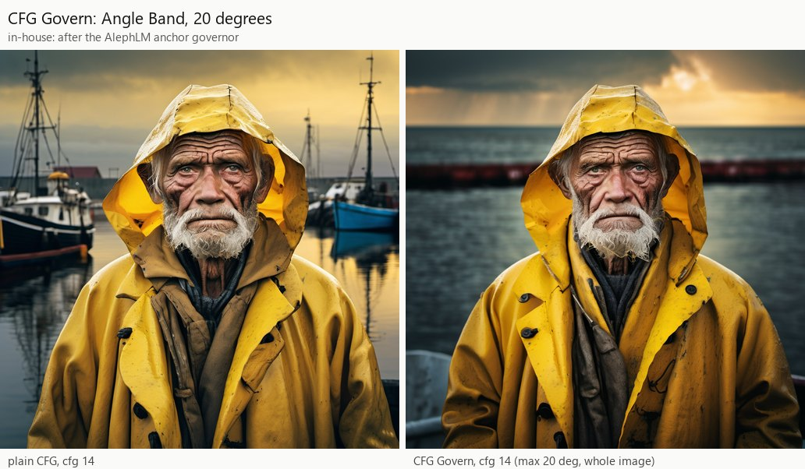

<sub>SDXL, cfg 14, max 20 degrees on the whole image; node graph: [docs/showcase/sdxl/Govern20.json](docs/showcase/sdxl/Govern20.json)</sub>

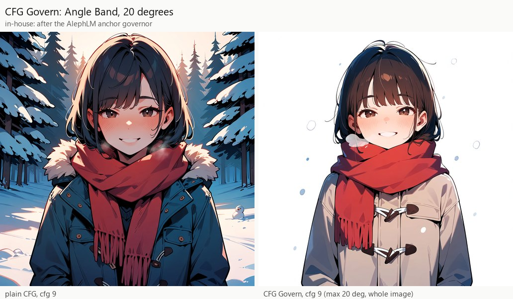

<sub>Anima, cfg 9, max 20 degrees; node graph: [docs/showcase/anima/Govern20.json](docs/showcase/anima/Govern20.json).
Held to 20 degrees through the composition steps, Anima settles on a plain background.</sub>

### 7 CFG Measure: Per-Step Probe, Plan Readout, Clear Plan

**Per-Step Probe** writes one JSON line per step to `output/cfg_probe/<prefix>_<time>_<run>.jsonl`: the scale
used (`w`), the size of `c - u` on the denoised image and in noise units, its cosine with c, how far guidance
pushed (`push_ratio`), the std ratio (the saturation signal), the low-frequency share, the |x0| range, the angles
(result versus conditional, whole image and per pixel), and with a governor how often each edge fired.
`print_every` also prints to the console. **Plan Readout** shows the plan on a model, stage by stage; **Clear Plan**
removes it.

### CFG Guider: Positive, Negative and Null

A guider for SamplerCustomAdvanced (**SamplerCustomAdvanced > guider**) that keeps the negative prompt apart from
the true unconditional (connect an empty-text CLIPTextEncode to **null**). Rules: **perp_neg** subtracts only the
part of the negative direction perpendicular to the positive one (Armandpour et al. 2023); **separate_negative** is
`null + cfg (positive - null) - negative_scale (negative - null)` (composable negation, Liu et al. 2022);
**negative_as_null** is classic CFG, for reference (bit-identical to ComfyUI's CFGGuider). The model's other stages
still apply. Three predictions per step (two for negative_as_null). The six negative-prompt paper nodes below are
guiders of the same kind, one per paper.

## The paper nodes

Each paper node writes one stage of the plan, like the stage nodes, with the paper's knobs and defaults; its
description in ComfyUI gives the rule and the source. The images compare the node with plain CFG on one prompt and
seed: every paper node on SDXL (1024 x 1024, 50 steps, dpmpp_2m karras; the methods made for high scales at cfg 14,
the rest at 7), and 16 of them on Anima (1024 x 1024, 50 steps, er_sde simple, shift 3; cfg 9 and 4.5). A knob set
away from its default for an image is named under it. The negative-prompt guiders show three panels: the prompt
with no negative (a few plants turn up unasked), ComfyUI's own negative prompt ("plants, potted plant, leaves"),
and the paper's guider with the same negative. Each comparison's node graph is in `docs/showcase/<model>/<node>.json`
(Workflow > Open loads it).

<!-- paper-sections:begin -->
### Combining the two predictions

#### CFG: Classifier-Free Guidance (Ho & Salimans 2022)

The baseline every other node reshapes: u + w (c - u), the conditional prediction pushed away from the unconditional one by the scale w.

Inputs:

- `scale`: the guidance scale (-1 = the sampler's cfg)
- `space`: where the rule is computed (default: auto, the method's own)

Source: Ho & Salimans, NeurIPS 2021 workshop / arXiv 2022, <https://arxiv.org/abs/2207.12598>. Node id `CFGP_CFG`.

#### Guidance Rescale (Lin et al. 2024)

Plain CFG, then its per-image standard deviation is pulled back to the conditional prediction's: x = phi * cfg * std(c) / std(cfg) + (1 - phi) * cfg. Fixes over-exposure at high scales.

Inputs:

- `scale`: the guidance scale (-1 = the sampler's cfg)
- `space`: where the rule is computed (default: auto, the method's own)
- `phi` (default 0.7): How much of the rescaled result is used (paper 0.5-0.75; 0 = plain CFG).

Source: Lin, Liu, Li & Yang, WACV 2024, <https://arxiv.org/abs/2305.08891>. Node id `CFGP_RescaleCFG`.


<sub>SDXL; node graph: [docs/showcase/sdxl/RescaleCFG.json](docs/showcase/sdxl/RescaleCFG.json)</sub>

#### Dynamic Thresholding (Imagen; Saharia et al. 2022)

Plain CFG on the denoised image, then each image is clipped to its p-th percentile of absolute values (at least s_max) and divided by it, which keeps pixel values in range at high scales.

Inputs:

- `scale`: the guidance scale (-1 = the sampler's cfg)
- `space`: where the rule is computed (default: auto, the method's own)
- `p` (default 0.995): The percentile that sets each image's clip value.
- `s_max` (default 1.0): The clip value never goes below this (1 = the static clip).

Source: Saharia et al., NeurIPS 2022, <https://arxiv.org/abs/2205.11487>. Node id `CFGP_DynamicThreshold`.

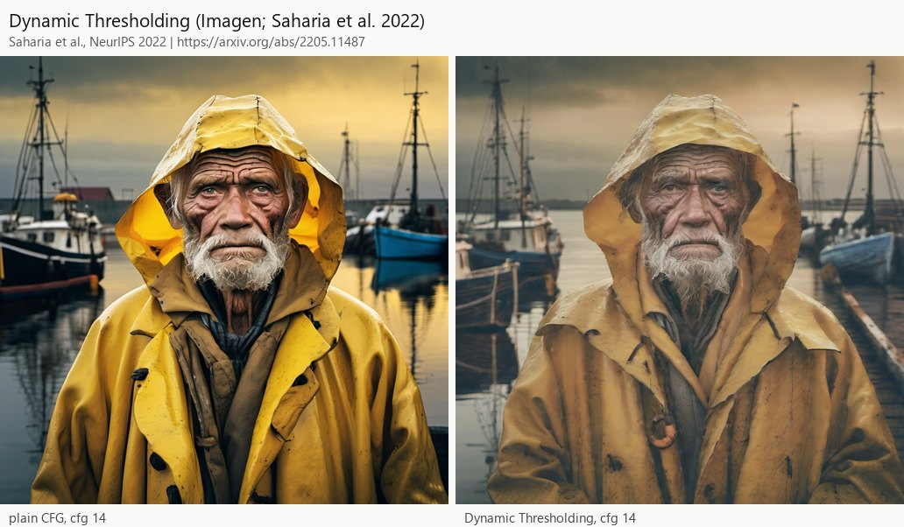

<sub>SDXL; node graph: [docs/showcase/sdxl/DynamicThreshold.json](docs/showcase/sdxl/DynamicThreshold.json)</sub>

#### Mimic-Scale Thresholding (mcmonkey 2023)

Runs CFG at a high real scale (the sampler's cfg, 15-30) and rescales it per channel so its spread matches CFG at the low mimic scale: the prompt adherence of a high scale with the colors of a low one.

Inputs:

- `scale`: the guidance scale (-1 = the sampler's cfg)
- `space`: where the rule is computed (default: auto, the method's own)
- `mimic_scale` (default 7.0): The scale whose value range is imitated.
- `threshold_percentile` (default 1.0): Percentile of the high-scale values used as their range (1 = the maximum).
- `separate_feature_channels` (default True): Measure each channel on its own (off: one value per batch).
- `scaling_startpoint` (MEAN, ZERO; default MEAN): Rescale around each channel's mean, or around zero.
- `variability_measure` (AD, STD; default AD): Measure the range by absolute deviation (clamped) or standard deviation.
- `interpolate_phi` (default 1.0): Blend with plain high-scale CFG (1 = fully rescaled).

Source: mcmonkey4eva, sd-dynamic-thresholding (community), <https://github.com/mcmonkeyprojects/sd-dynamic-thresholding>. Node id `CFGP_MimicScale`.

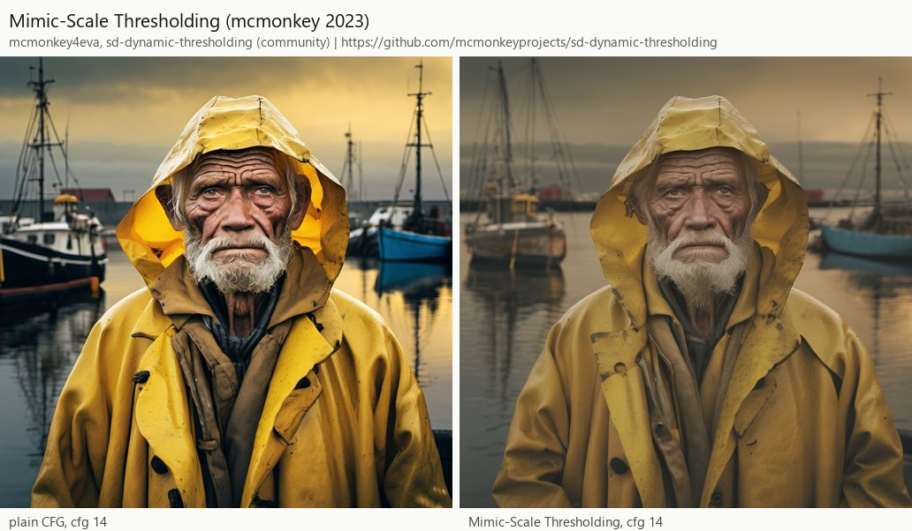

<sub>SDXL; node graph: [docs/showcase/sdxl/MimicScale.json](docs/showcase/sdxl/MimicScale.json)</sub>

#### APG: Adaptive Projected Guidance (Sadat et al. 2025)

Splits the guidance difference g = c - u into its part along c and the rest, keeps the rest, down-weights the part along c (eta), caps the norm of g and adds reverse momentum: high scales without over-saturation. Paper form: c + (w - 1) (g_perp + eta g_par).

Inputs:

- `scale`: the guidance scale (-1 = the sampler's cfg)
- `space`: where the rule is computed (default: auto, the method's own)
- `eta` (default 0.0): Weight of the part along c (1 with no cap and no momentum = plain CFG).
- `norm_threshold` (default 15.0): Cap on the norm of g (0 = no cap; choose near its typical size).
- `momentum` (default -0.5): Reverse momentum on g (paper SDXL -0.5; 0 = off).
- `formulation` (paper, comfyui, diffusers; default paper): paper: c + (w-1) g'; comfyui: c + w g'; diffusers: u + w g'.

Source: Sadat, Hilliges & Weber, ICLR 2025, <https://arxiv.org/abs/2410.02416>. Node id `CFGP_APG`.


<sub>SDXL; node graph: [docs/showcase/sdxl/APG.json](docs/showcase/sdxl/APG.json)</sub>

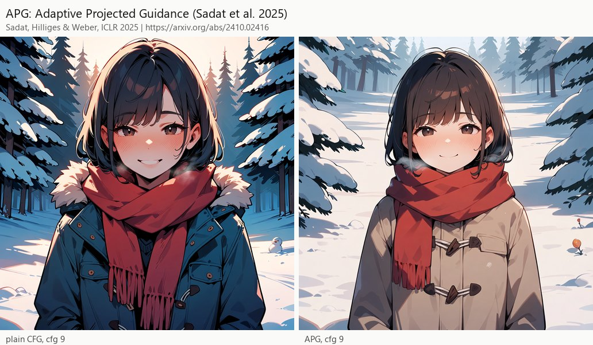

<sub>Anima; node graph: [docs/showcase/anima/APG.json](docs/showcase/anima/APG.json)</sub>

#### CFG-Zero* (Fan et al. 2025)

Scales the unconditional prediction to best fit the conditional one first, s* = <c, u> / ||u||^2, then s* u + w (c - s* u); the first steps can leave the latent unmoved (zero-init). Built for flow models.

Inputs:

- `scale`: the guidance scale (-1 = the sampler's cfg)
- `space`: where the rule is computed (default: auto, the method's own)
- `zero_init_steps` (default 1): The first N steps leave the latent unmoved (0 = off).

Source: Fan, Zheng, Yeh & Liu, arXiv 2025, <https://arxiv.org/abs/2503.18886>. Node id `CFGP_CFGZeroStar`.

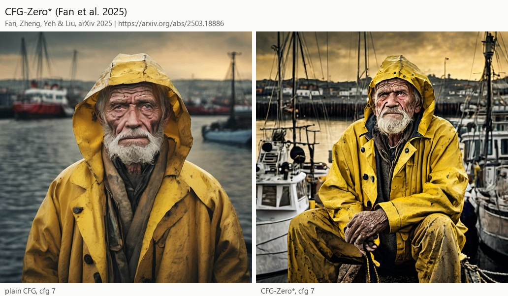

<sub>SDXL; node graph: [docs/showcase/sdxl/CFGZeroStar.json](docs/showcase/sdxl/CFGZeroStar.json)</sub>

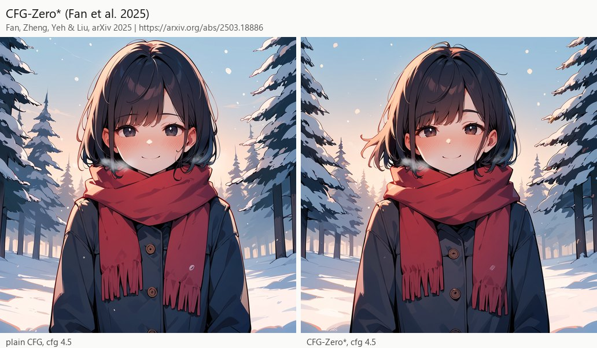

<sub>Anima; node graph: [docs/showcase/anima/CFGZeroStar.json](docs/showcase/anima/CFGZeroStar.json)</sub>

#### TCFG: Tangential Damping CFG (Kwon et al. 2025)

Removes the part of the unconditional prediction that lies off the main direction shared by both predictions (a rank-one projection from their 2 x N matrix), then plain CFG.

Inputs:

- `scale`: the guidance scale (-1 = the sampler's cfg)
- `space`: where the rule is computed (default: auto, the method's own)

Source: Kwon, Kim, Jeong, Hsiao & Uh, CVPR 2025, <https://arxiv.org/abs/2503.18137>. Node id `CFGP_TCFG`.

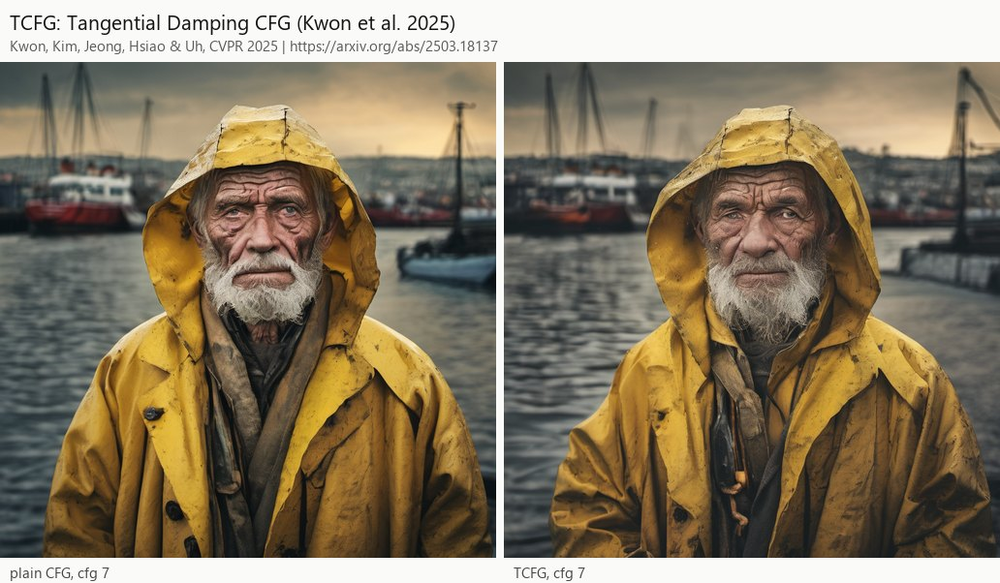

<sub>SDXL; node graph: [docs/showcase/sdxl/TCFG.json](docs/showcase/sdxl/TCFG.json)</sub>

#### beta-CFG (Malarz et al. 2025)

A Beta-shaped schedule over the run with the guidance difference normalized: u + w * Beta(p; a, b) * (c - u) / ||c - u||^gamma. Re-tune the scale per model.

Inputs:

- `scale`: the guidance scale (-1 = the sampler's cfg)
- `space`: where the rule is computed (default: auto, the method's own)
- `a` (default 2.0): Beta shape a (paper 2; 3 for scales of 5 and more).
- `b` (default 2.0): Beta shape b.
- `gamma` (default 1.0): Power of the norm the difference is divided by (0 = no normalization).
- `peak_normalize` (default False): Divide the Beta curve by its peak, so the scale never exceeds w.

Source: Malarz, Kasymov, Zieba, Tabor & Spurek, ECAI 2025, <https://arxiv.org/abs/2502.10574>. Node id `CFGP_BetaCFG`.

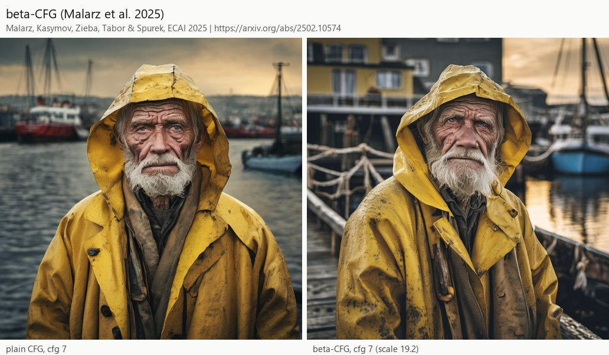

<sub>SDXL; node graph: [docs/showcase/sdxl/BetaCFG.json](docs/showcase/sdxl/BetaCFG.json)</sub>

#### ADG: Angle Domain Guidance (Jin et al. 2025)

Guides by angle instead of length: the denoised prediction turns away from the unconditional one by (w - 1) times their angle, capped at a maximum, which bounds the norm of the result.

Inputs:

- `scale`: the guidance scale (-1 = the sampler's cfg)
- `space`: where the rule is computed (default: auto, the method's own)
- `max_angle_degrees` (default 60.0): Largest turn away from the conditional prediction (paper 60).

Source: Jin, Xiao, Liu & Gu, ICML 2025, <https://arxiv.org/abs/2506.11039>. Node id `CFGP_ADG`.

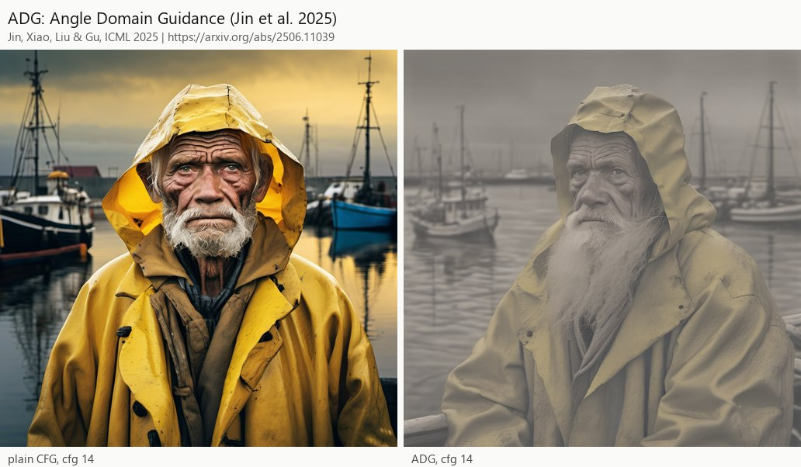

<sub>SDXL; node graph: [docs/showcase/sdxl/ADG.json](docs/showcase/sdxl/ADG.json). The formula matches the official code, and the faded color is what it does on SDXL at the paper's 60-degree cap: the two denoised estimates start 45 degrees apart and stay more than 4.6 degrees apart for about the first 10 steps, so at cfg 14 the cap binds there, and each capped step keeps only half (cos 60) of the conditional estimate. A 30-degree cap keeps more color. On Anima, a flow model like the paper's SD3.5, the default keeps its color (below).</sub>

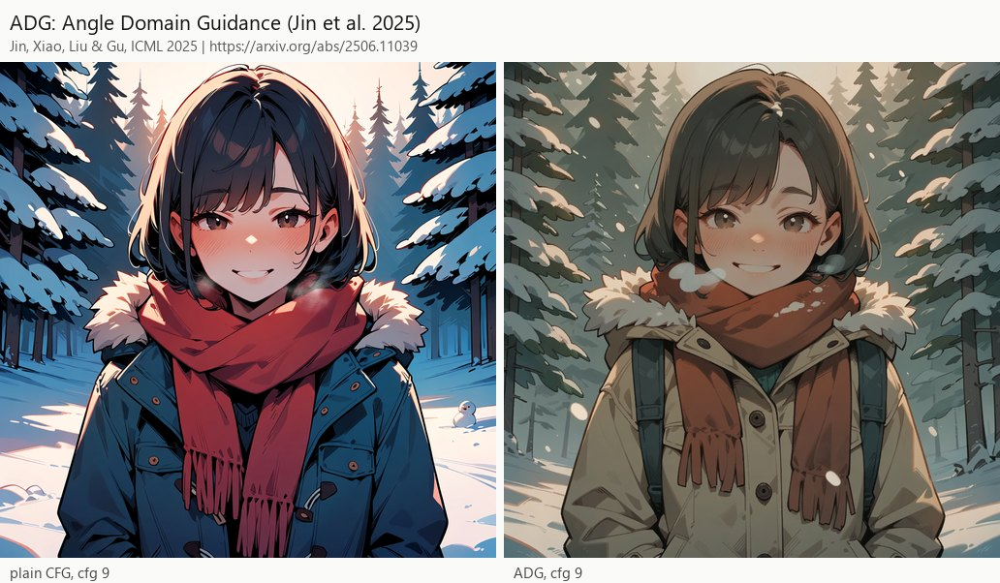

<sub>Anima; node graph: [docs/showcase/anima/ADG.json](docs/showcase/anima/ADG.json)</sub>

#### Power-Law CFG (Lehman Pavasovic et al. 2025)

The scale grows with the size of the difference: c + omega ||c - u||^alpha (c - u). Re-tune omega per model and resolution.

Inputs:

- `scale`: the guidance scale (-1 = the sampler's cfg)
- `space`: where the rule is computed (default: auto, the method's own)
- `alpha` (default 0.9): Exponent on the difference's norm (0 = plain CFG).
- `omega` (default -1.0): The coefficient (-1 = w - 1).

Source: Lehman Pavasovic, Verbeek, Biroli & Mezard, arXiv 2025, <https://arxiv.org/abs/2502.07849>. Node id `CFGP_PowerLawCFG`.

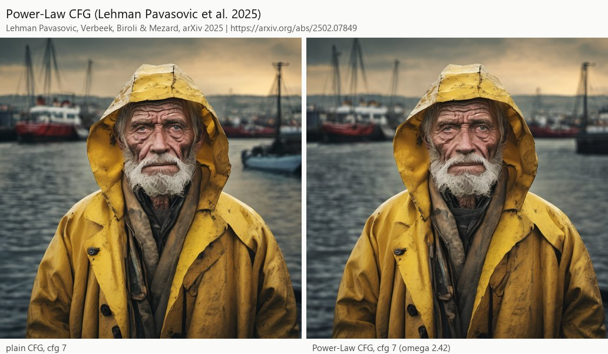

<sub>SDXL; node graph: [docs/showcase/sdxl/PowerLawCFG.json](docs/showcase/sdxl/PowerLawCFG.json)</sub>

#### EP-CFG: Energy-Preserving CFG (Zhang et al. 2024)

Plain CFG rescaled so its energy (sum of squares) equals the conditional prediction's; the robust form counts only the middle percentiles of the squared values.

Inputs:

- `scale`: the guidance scale (-1 = the sampler's cfg)
- `space`: where the rule is computed (default: auto, the method's own)
- `robust` (default True): Measure energy between two percentiles only (paper).
- `lo` (default 45.0): Lower percentile of the robust energy.
- `hi` (default 55.0): Upper percentile of the robust energy.

Source: Zhang, Luan, Bi & Zhang, arXiv 2024, <https://arxiv.org/abs/2412.09966>. Node id `CFGP_EPCFG`.

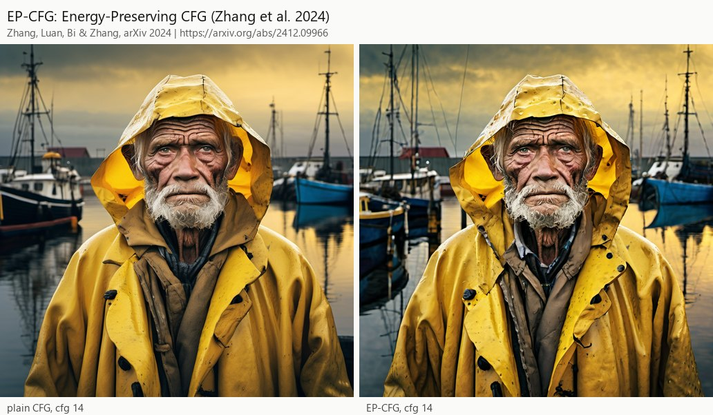

<sub>SDXL; node graph: [docs/showcase/sdxl/EPCFG.json](docs/showcase/sdxl/EPCFG.json)</sub>

#### CFG-Renorm (Qin et al. 2025; Lumina-Image 2.0)

Plain CFG, then its norm is capped at rho times the conditional prediction's norm.

Inputs:

- `scale`: the guidance scale (-1 = the sampler's cfg)
- `space`: where the rule is computed (default: auto, the method's own)
- `rho` (default 1.0): The cap as a multiple of ||c|| (0 = off; 1-1.5 used).

Source: Qin et al., arXiv 2025 (after STIV), <https://arxiv.org/abs/2503.21758>. Node id `CFGP_CFGRenorm`.


<sub>SDXL; node graph: [docs/showcase/sdxl/CFGRenorm.json](docs/showcase/sdxl/CFGRenorm.json)</sub>

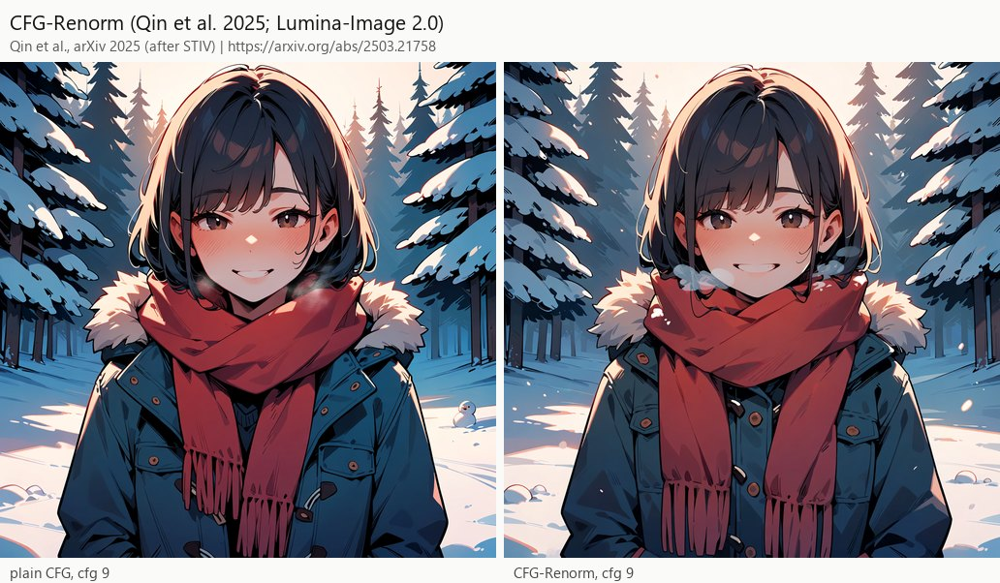

<sub>Anima; node graph: [docs/showcase/anima/CFGRenorm.json](docs/showcase/anima/CFGRenorm.json)</sub>

#### CFGNorm: per-pixel norm matching (Qwen-Image)

Plain CFG with each pixel's channel vector rescaled to the conditional prediction's length (match) or only shortened when longer (attenuate).

Inputs:

- `scale`: the guidance scale (-1 = the sampler's cfg)
- `space`: where the rule is computed (default: auto, the method's own)
- `strength` (default 1.0): Blend of the rescaled and the plain result.
- `mode` (match, attenuate; default match): match (Qwen-Image) or attenuate (ComfyUI CFGNorm).

Source: Qwen-Image pipeline; ComfyUI CFGNorm (no paper), <https://github.com/QwenLM/Qwen-Image>. Node id `CFGP_CFGNorm`.

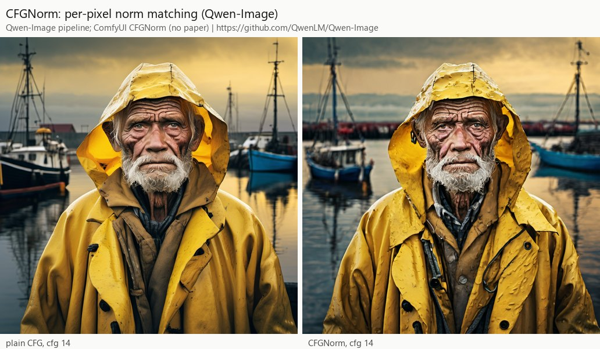

<sub>SDXL; node graph: [docs/showcase/sdxl/CFGNorm.json](docs/showcase/sdxl/CFGNorm.json)</sub>

#### MAMBO-G: magnitude-aware guidance damping (Zhu et al. 2025)

The scale shrinks where the difference is large relative to the unconditional prediction: w_eff = 1 + (w - 1) exp(-alpha ||c - u|| / ||u||).

Inputs:

- `scale`: the guidance scale (-1 = the sampler's cfg)
- `space`: where the rule is computed (default: auto, the method's own)
- `alpha` (default 8.0): Damping strength (0 = plain CFG).

Source: Zhu et al., arXiv 2025, <https://arxiv.org/abs/2508.03442>. Node id `CFGP_MAMBOG`.

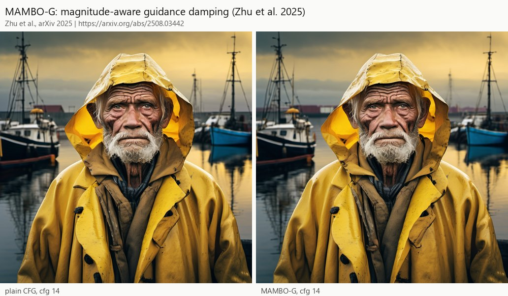

<sub>SDXL; node graph: [docs/showcase/sdxl/MAMBOG.json](docs/showcase/sdxl/MAMBOG.json)</sub>

#### Skimmed CFG (Extraltodeus)

Where guidance would push a value past both predictions in the same direction, that value is pulled back to what a lower skimming scale would give; lets high scales run without burning.

Inputs:

- `scale`: the guidance scale (-1 = the sampler's cfg)
- `space`: where the rule is computed (default: auto, the method's own)
- `skimming_scale` (default 7.0): The scale the flagged values fall back to.
- `full_skim_negative` (default False): Skim the negative side completely.
- `disable_flipping_filter` (default False): Drop the check against the current latent.

Source: Extraltodeus, Skimmed_CFG (community), <https://github.com/Extraltodeus/Skimmed_CFG>. Node id `CFGP_SkimmedCFG`.

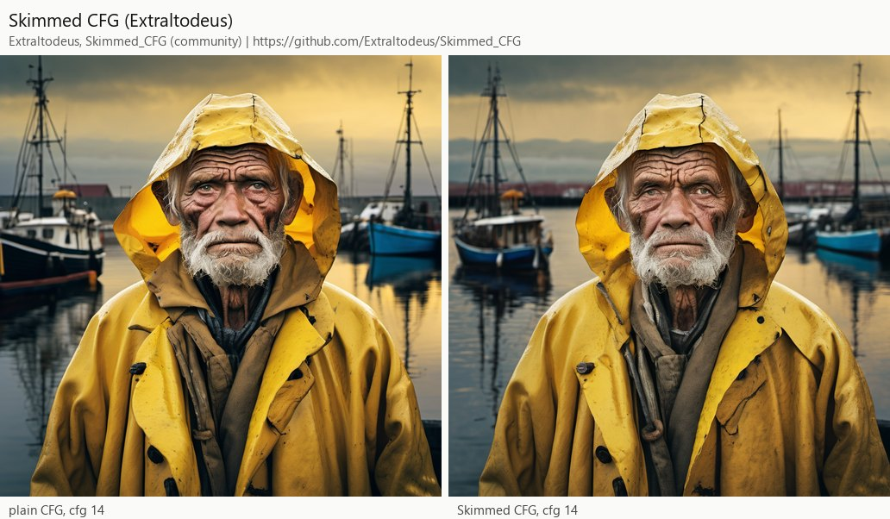

<sub>SDXL; node graph: [docs/showcase/sdxl/SkimmedCFG.json](docs/showcase/sdxl/SkimmedCFG.json)</sub>

#### Automatic CFG (Extraltodeus)

Picks a scale per channel so each channel's guided range lands on a target set by the reference scale.

Inputs:

- `scale`: the guidance scale (-1 = the sampler's cfg)
- `space`: where the rule is computed (default: auto, the method's own)
- `reference_scale` (default 8.0): The scale whose range is targeted (0 = the sampler's cfg).
- `top_k` (default 0.25): Share of values averaged for the range.
- `mode` (hard, soft, hard_squared, range; default hard): How the range is measured.

Source: Extraltodeus, ComfyUI-AutomaticCFG (community), <https://github.com/Extraltodeus/ComfyUI-AutomaticCFG>. Node id `CFGP_AutomaticCFG`.

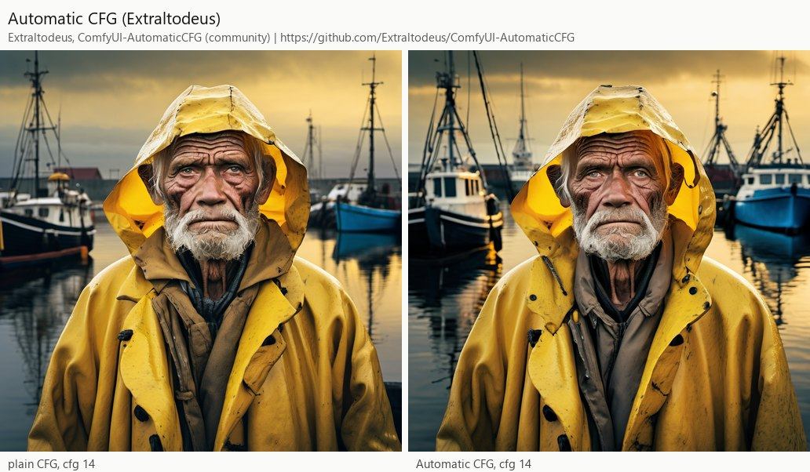

<sub>SDXL; node graph: [docs/showcase/sdxl/AutomaticCFG.json](docs/showcase/sdxl/AutomaticCFG.json)</sub>

#### Mahiro: positive-biased guidance (ComfyUI)

Blends CFG toward the scaled conditional prediction by how similar the two are (a batch-wide cosine on signed square roots).

Inputs:

- `scale`: the guidance scale (-1 = the sampler's cfg)
- `space`: where the rule is computed (default: auto, the method's own)

Source: ComfyUI Mahiro node, PR 5975 (community), <https://github.com/comfyanonymous/ComfyUI/pull/5975>. Node id `CFGP_Mahiro`.

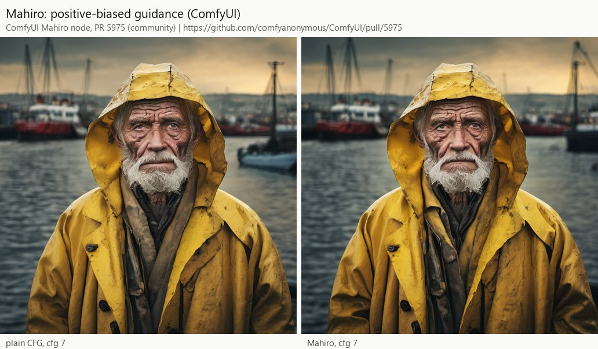

<sub>SDXL; node graph: [docs/showcase/sdxl/Mahiro.json](docs/showcase/sdxl/Mahiro.json)</sub>

#### Reinhard tonemap of the guidance (ComfyUI)

Each pixel's guidance difference is tone-mapped with the Reinhard curve m / (m + 1) against a per-image ceiling, so large differences saturate smoothly.

Inputs:

- `scale`: the guidance scale (-1 = the sampler's cfg)
- `space`: where the rule is computed (default: auto, the method's own)
- `multiplier` (default 1.0): Raises the ceiling (large = plain CFG).

Source: comfyanonymous, LatentOperationTonemapReinhard (community), <https://github.com/comfyanonymous/ComfyUI>. Node id `CFGP_ReinhardCFG`.

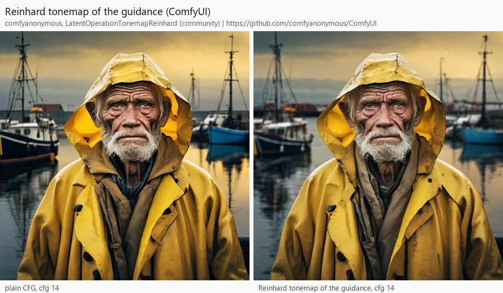

<sub>SDXL; node graph: [docs/showcase/sdxl/ReinhardCFG.json](docs/showcase/sdxl/ReinhardCFG.json)</sub>

#### SMC-CFG: sliding-mode control CFG (Wang et al. 2026)

Treats the guidance difference as a controlled signal: a sliding surface on its change between steps adds a bounded correction, -k sign(s).

Inputs:

- `scale`: the guidance scale (-1 = the sampler's cfg)
- `space`: where the rule is computed (default: auto, the method's own)
- `lam` (default 5.0): Sliding-surface slope.
- `k` (default -1.0): Correction size per element (0 = plain CFG; -1 = auto: the paper's 0.2 on flow models, 0.01 on noise-prediction models such as SDXL, where the paper's value wrecks the image).
- `switching` (sign, unit; default sign): sign (paper) or unit vector (the ComfyUI node's form).

Source: Wang, Liu, Chi, Liu, Xue & Duan, CVPR 2026, <https://arxiv.org/abs/2603.03281>. Node id `CFGP_SMCCFG`.

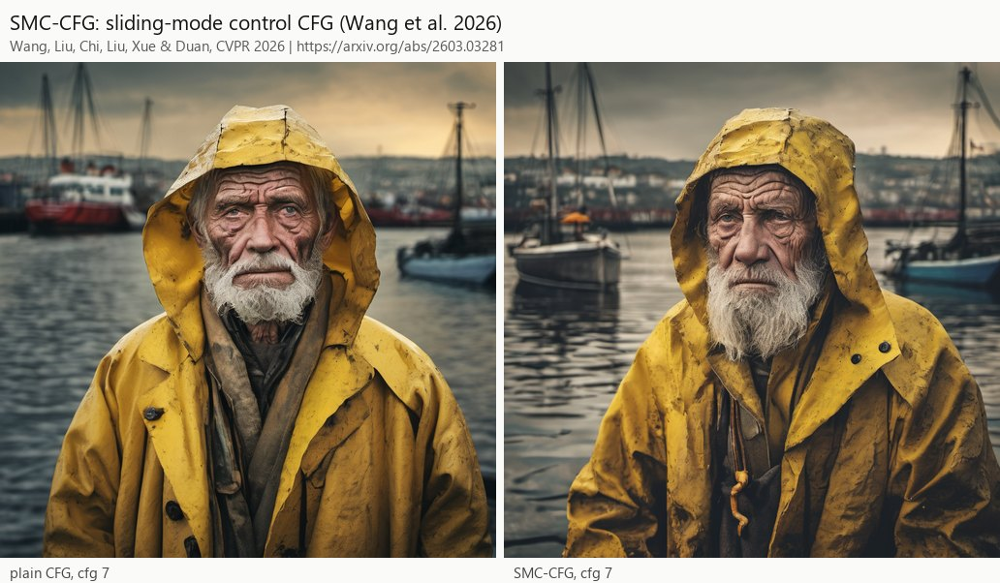

<sub>SDXL; node graph: [docs/showcase/sdxl/SMCCFG.json](docs/showcase/sdxl/SMCCFG.json). k auto = 0.01 here. The paper's 0.2 wrecks SDXL images (tested with dpmpp_2m and with euler): on the noise prediction the correction moves the denoised estimate by sigma x cfg x k per element, and SDXL's sigma starts at 14.6. On Anima the paper's value works (below).</sub>

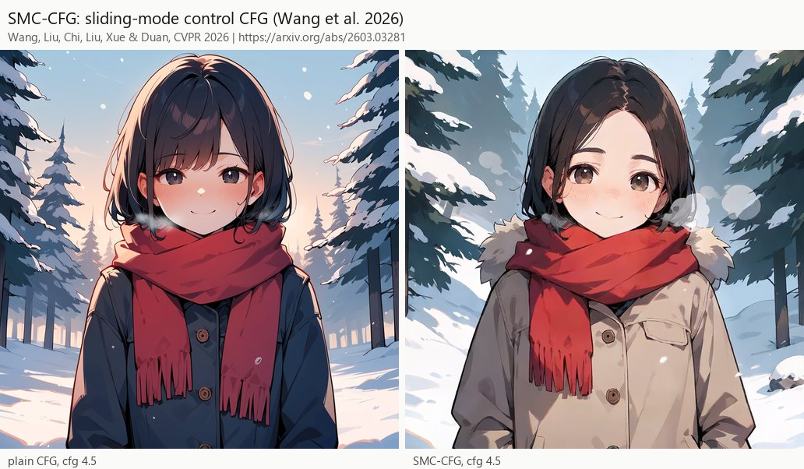

<sub>Anima; node graph: [docs/showcase/anima/SMCCFG.json](docs/showcase/anima/SMCCFG.json). k auto = 0.2, the paper's own value, on this flow model.</sub>

#### PMC-CFG: posterior-mean capped CFG (Peng & Ma 2026)

Picks per image the largest guidance step along c - u that keeps the denoised prediction within gamma_cap times the conditional one's norm.

Inputs:

- `scale`: the guidance scale (-1 = the sampler's cfg)
- `space`: where the rule is computed (default: auto, the method's own)
- `gamma_cap` (default 1.05): The norm cap (1.05-1.15; large = plain CFG).

Source: Peng & Ma, arXiv 2026, <https://arxiv.org/abs/2609.24287>. Node id `CFGP_PMCCFG`.

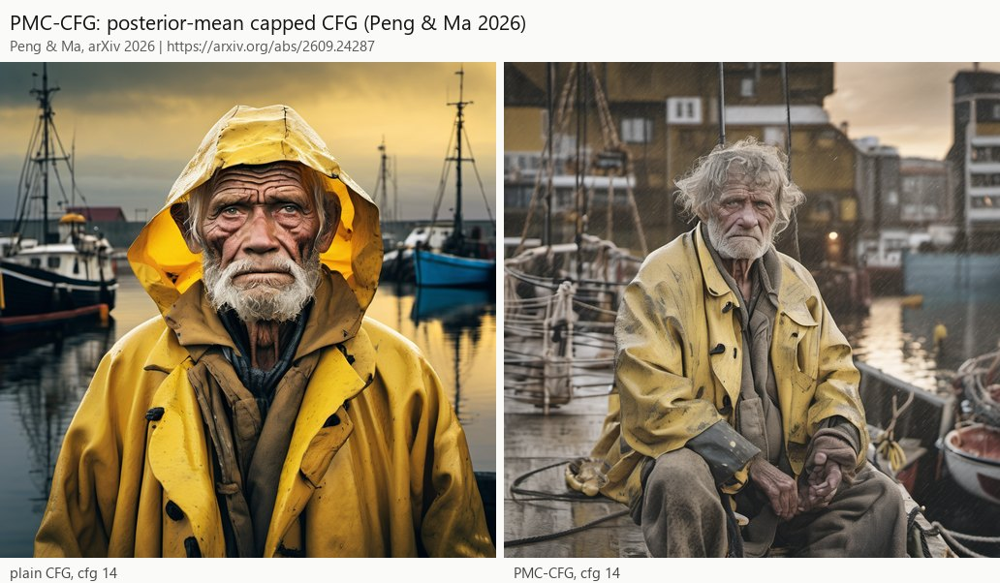

<sub>SDXL; node graph: [docs/showcase/sdxl/PMCCFG.json](docs/showcase/sdxl/PMCCFG.json). At gamma_cap 1.05 the layout and color come out close to unguided on SDXL. The paper names this limit: the cap holds guidance near zero where the conditional estimate is small, as in the first steps. A larger gamma_cap guides more; on Anima the default guides normally (below).</sub>

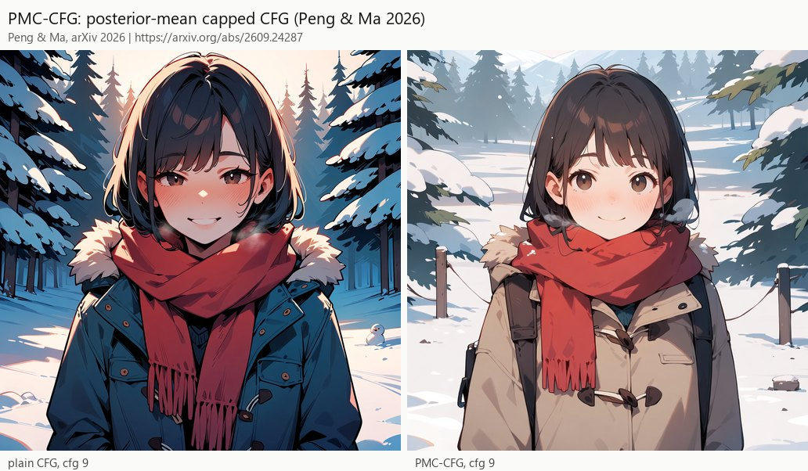

<sub>Anima; node graph: [docs/showcase/anima/PMCCFG.json](docs/showcase/anima/PMCCFG.json)</sub>

#### AdaMaG: adaptive manifold guidance (Esmati et al. 2026)

Splits the guidance difference along the conditional noise estimate, keeps a little of that part (beta) and all of the rest, with a scale that falls as the noise level falls: max(w_min, w t^gamma).

Inputs:

- `scale`: the guidance scale (-1 = the sampler's cfg)
- `space`: where the rule is computed (default: auto, the method's own)
- `beta` (default 0.1): Weight of the part along the noise estimate.
- `gamma` (default 4.0): How fast the scale falls with the noise level.
- `w_min` (default 1.0): Lowest scale.

Source: Esmati, Hyung, Dadashzadeh, Choo & Mirmehdi, arXiv 2026, <https://arxiv.org/abs/2605.20079>. Node id `CFGP_AdaMaG`.

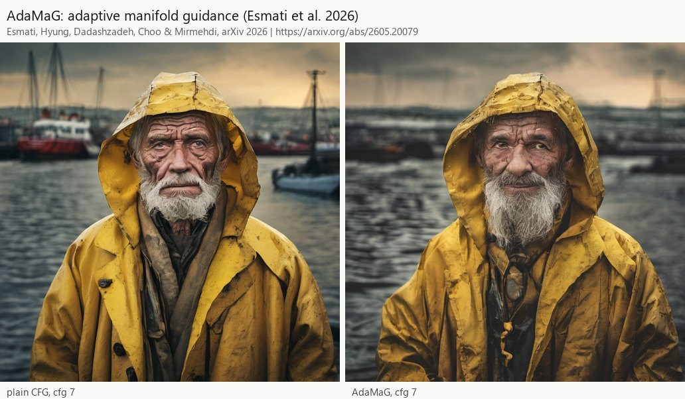

<sub>SDXL; node graph: [docs/showcase/sdxl/AdaMaG.json](docs/showcase/sdxl/AdaMaG.json)</sub>

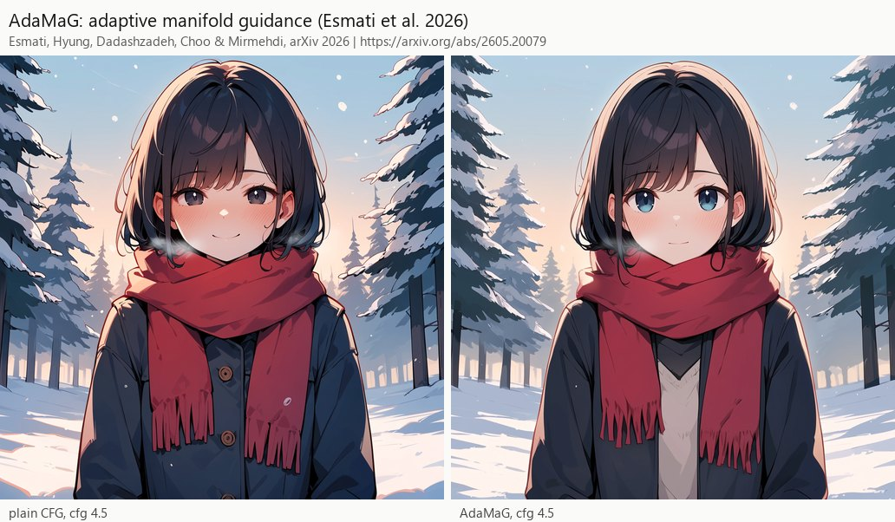

<sub>Anima; node graph: [docs/showcase/anima/AdaMaG.json](docs/showcase/anima/AdaMaG.json)</sub>

#### FBG: Feedback Guidance (Koulischer et al. 2025)

Sets its own scale every step from a running estimate of how well the sample already fits the prompt (a posterior updated from the last step): strong while the fit is poor, near 1 once it is good. The sampler's cfg is used only with hybrid on.

Inputs:

- `scale`: the guidance scale (-1 = the sampler's cfg)
- `space`: where the rule is computed (default: auto, the method's own)
- `hybrid` (default False): Add the sampler's plain CFG (w - 1) on top (FBG + CFG).
- `pi` (default 0.85): Prior that the sample is conditional (the paper's Stable Diffusion images 0.85; its code's default 0.95).
- `t0` (default 0.75): Noise level where the scale should reach its target (paper SD images 0.75; code 0.5).
- `t1` (default 0.5): Second calibration point (paper SD images 0.5; code 0.4).
- `lambda_max` (default 10.0): Highest scale.

Source: Koulischer, Handke, Deleu, Demeester & Ambrogioni, NeurIPS 2025, <https://arxiv.org/abs/2506.06085>. Node id `CFGP_FBG`.

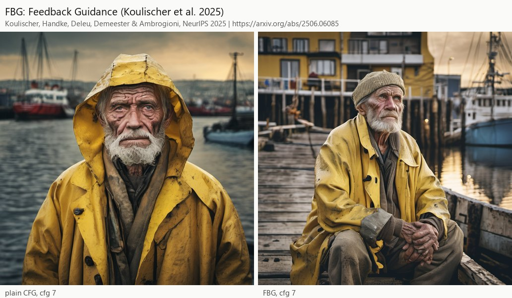

<sub>SDXL; node graph: [docs/showcase/sdxl/FBG.json](docs/showcase/sdxl/FBG.json). FBG sets its own scale; the sampler's cfg is not used. The node starts at the paper's settings for its Stable Diffusion images (pi 0.85, t0 0.75, t1 0.5); the code's defaults (0.95, 0.5, 0.4) leave the first steps almost unguided and wash the image out on SDXL.</sub>

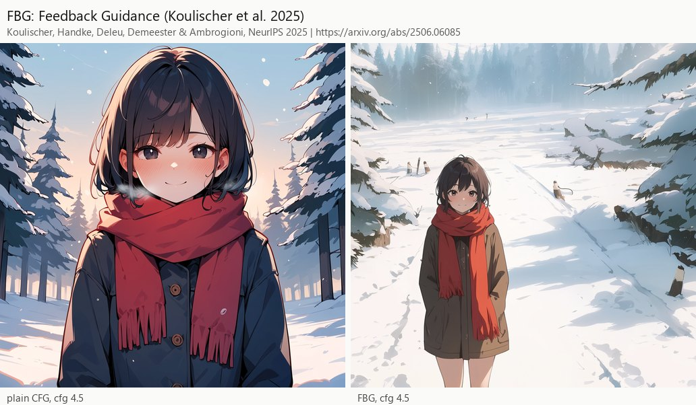

<sub>Anima; node graph: [docs/showcase/anima/FBG.json](docs/showcase/anima/FBG.json). FBG sets its own scale; the sampler's cfg is not used (the paper's Stable Diffusion settings).</sub>

#### VAGS: velocity-adaptive guidance scale (Luo et al. 2026)

Scales w by exp(kappa (2 s - 1) cos(u, c)), s the signal level: more guidance where the predictions agree late in the run, less early.

Inputs:

- `scale`: the guidance scale (-1 = the sampler's cfg)
- `space`: where the rule is computed (default: auto, the method's own)
- `kappa` (default 1.0): Strength of the adaptation (0 = plain CFG).

Source: Luo, Aidara, Lu, Moebel, Han & Wang, arXiv 2026, <https://arxiv.org/abs/2605.15661>. Node id `CFGP_VAGS`.

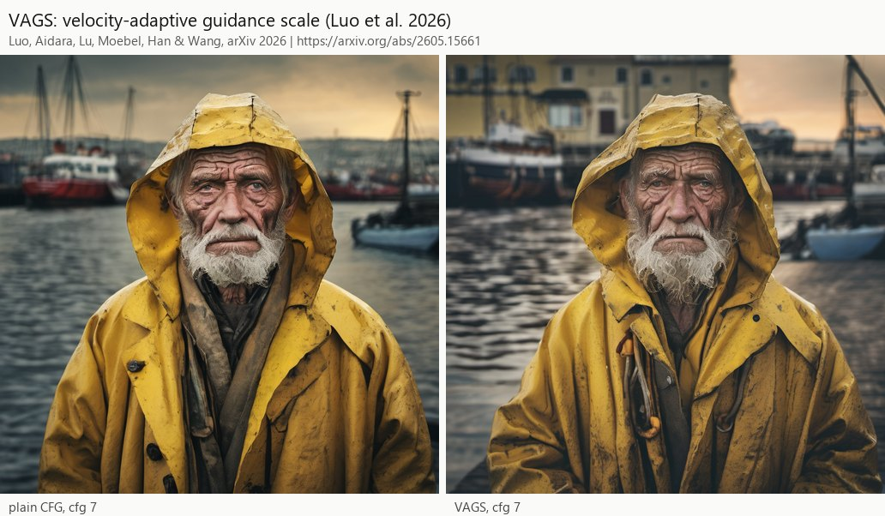

<sub>SDXL; node graph: [docs/showcase/sdxl/VAGS.json](docs/showcase/sdxl/VAGS.json)</sub>

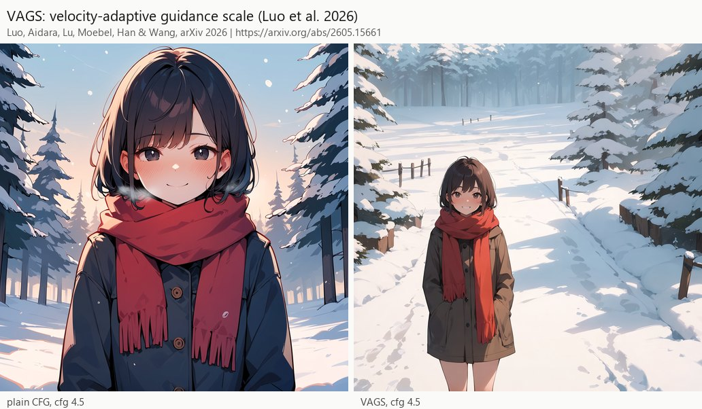

<sub>Anima; node graph: [docs/showcase/anima/VAGS.json](docs/showcase/anima/VAGS.json)</sub>

#### CFG-OEC: orthogonal error correction (Yang et al. 2025)

Corrects the unconditional prediction with the part of its step-to-step error that is orthogonal to the conditional one's, when the two errors disagree (cosine below tau).

Inputs:

- `scale`: the guidance scale (-1 = the sampler's cfg)
- `space`: where the rule is computed (default: auto, the method's own)
- `tau` (default 0.5): Correct when the errors' cosine is below this (-1 = plain CFG; the paper gives no value).

Source: Yang, Lee & Han, arXiv 2025, <https://arxiv.org/abs/2511.14075>. Node id `CFGP_CFGOEC`.


<sub>SDXL; node graph: [docs/showcase/sdxl/CFGOEC.json](docs/showcase/sdxl/CFGOEC.json)</sub>

#### HiGS: history-guided sampling (Sadat et al. 2025)

Adds the high-frequency part of the difference between this step's guided prediction and an average of the past ones, in the middle of the run: sharper detail without extra passes.

Inputs:

- `scale`: the guidance scale (-1 = the sampler's cfg)
- `space`: where the rule is computed (default: auto, the method's own)
- `w_h` (default 2.0): Strength of the history term.
- `alpha` (default 0.75): Averaging weight of the history.
- `t_min` (default 0.4): Active above this noise level.
- `t_max` (default 0.95): Active below this noise level.
- `eta` (default 1.0): Weight of the history term's part along the prediction.
- `cutoff` (default 0.05): High-pass cutoff (share of the spectrum).

Source: Sadat, Salehi & Weber, arXiv 2025, <https://arxiv.org/abs/2509.22300>. Node id `CFGP_HiGS`.

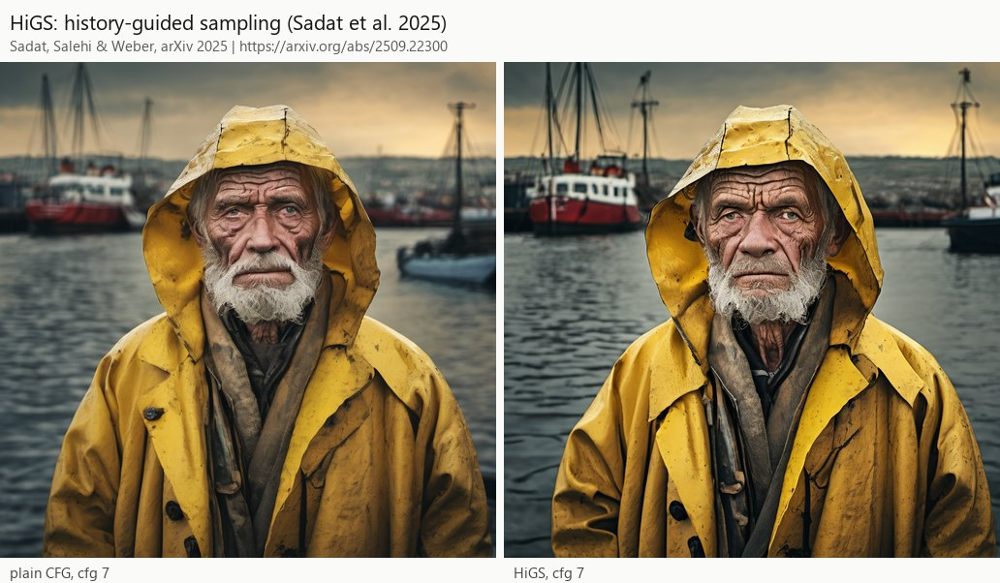

<sub>SDXL; node graph: [docs/showcase/sdxl/HiGS.json](docs/showcase/sdxl/HiGS.json)</sub>

#### TSR: Temporal Score Rescaling (Xu et al. 2025)

Plain CFG, then the noise estimate is scaled by r = (eta s^2 + 1) / (eta s^2 / k + 1), eta the signal-to-noise ratio: k < 1 sharpens toward the dominant modes.

Inputs:

- `scale`: the guidance scale (-1 = the sampler's cfg)
- `space`: where the rule is computed (default: auto, the method's own)
- `k` (default 0.95): 1 = off (paper SD3 / FLUX 0.93).
- `tsr_sigma` (default 1.0): The rescaling's own sigma (paper SD3 / FLUX 3).

Source: Xu, Wu, Park, Zhou & Tulsiani, ICML 2026, <https://arxiv.org/abs/2510.01184>. Node id `CFGP_TSR`.

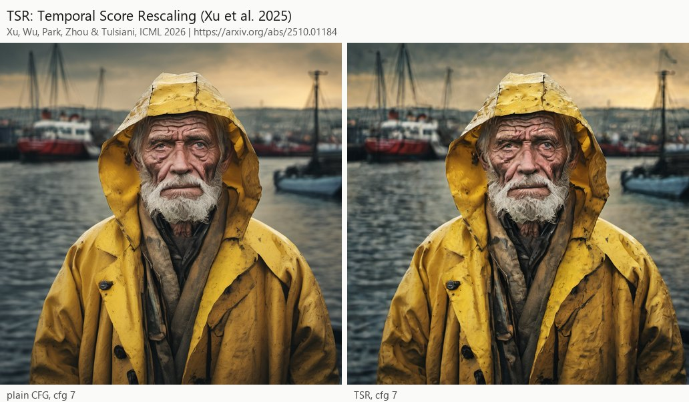

<sub>SDXL; node graph: [docs/showcase/sdxl/TSR.json](docs/showcase/sdxl/TSR.json)</sub>

#### Epsilon Scaling (Ning et al. 2024)

Plain CFG, then the noise estimate is divided by a factor slightly above 1 (exposure-bias correction).

Inputs:

- `scale`: the guidance scale (-1 = the sampler's cfg)
- `space`: where the rule is computed (default: auto, the method's own)
- `factor` (default 1.005): The divisor (1 = off).

Source: Ning, Li, Su, Salah & Ertugrul, ICLR 2024, <https://arxiv.org/abs/2308.15321>. Node id `CFGP_EpsilonScaling`.

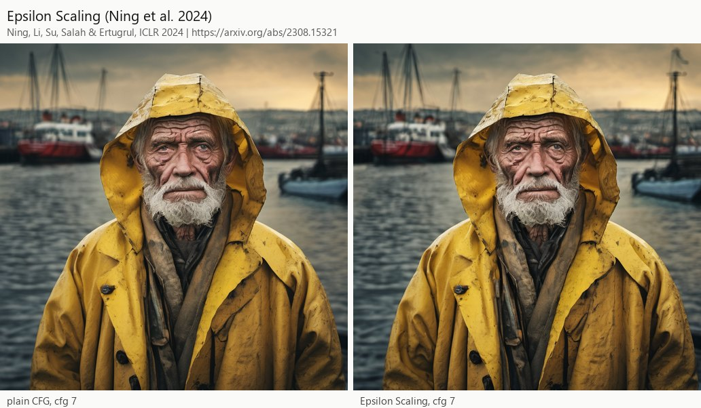

<sub>SDXL; node graph: [docs/showcase/sdxl/EpsilonScaling.json](docs/showcase/sdxl/EpsilonScaling.json)</sub>

### When to guide

#### Adaptive Guidance (Castillo et al. 2023)

Full CFG until the two predictions agree (cosine above the threshold), then the conditional prediction alone for the rest of the run. The node reads the cosine of the denoised predictions, as ComfyUI's community node for this method does: SDXL's two noise predictions differ by about 1% of their size, so their cosine starts above 0.9999 and the paper's reading would stop guidance at the first step.

Inputs:

- `scale`: the guidance scale (-1 = the sampler's cfg)
- `space`: where the rule is computed (default: denoised (x0))
- `threshold` (default 0.999): Cosine of the denoised predictions where guidance stops. Measured over 50 steps: 0.999 stops it after 18 steps on SDXL (cfg 7) and 25 on Anima (cfg 4.5); the paper's 0.991 (read on its own models, about half of 20 steps) would stop it after 8 and 13 here.

Source: Castillo et al., AAAI 2025, <https://arxiv.org/abs/2312.12487>. Node id `CFGP_AdaptiveGuidance`.

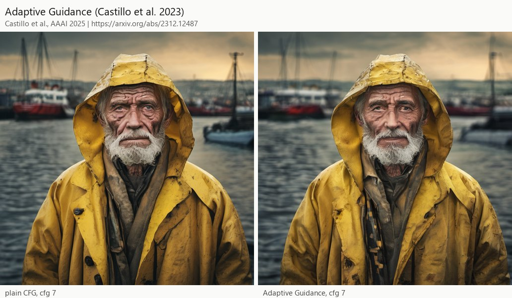

<sub>SDXL; node graph: [docs/showcase/sdxl/AdaptiveGuidance.json](docs/showcase/sdxl/AdaptiveGuidance.json). Guidance stops after 18 of the 50 steps, when the cosine of the two denoised predictions passes 0.999; the rest of the run is conditional only.</sub>

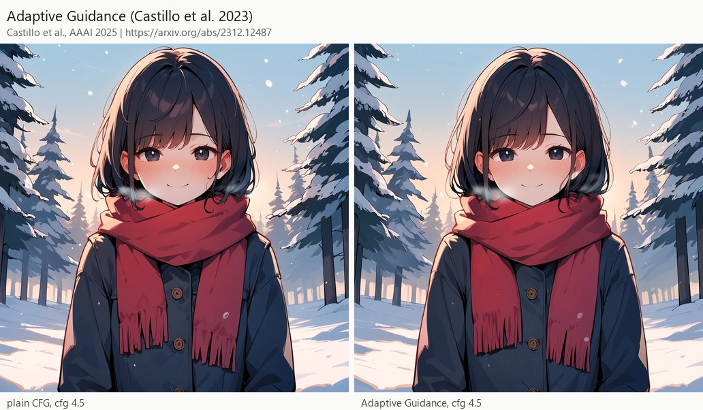

<sub>Anima; node graph: [docs/showcase/anima/AdaptiveGuidance.json](docs/showcase/anima/AdaptiveGuidance.json). Guidance stops after 25 of the 50 steps (the cosine of the denoised predictions passes 0.999).</sub>

#### Transition-Point Guidance (Jain et al. 2024)

No guidance (or opposite guidance) until the difference between the predictions passes a local minimum, full CFG after it; against memorized images.

Inputs:

- `scale`: the guidance scale (-1 = the sampler's cfg)
- `space`: where the rule is computed (default: auto, the method's own)
- `opposite` (default 0.0): Opposite guidance before the transition (0 = the unconditional prediction).

Source: Jain et al., CVPR 2025, <https://arxiv.org/abs/2411.16738>. Node id `CFGP_TransitionPoint`.

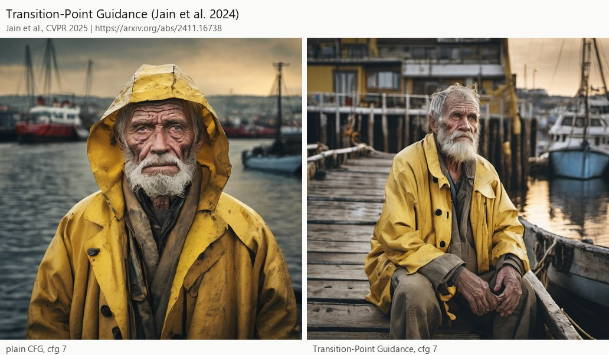

<sub>SDXL; node graph: [docs/showcase/sdxl/TransitionPoint.json](docs/showcase/sdxl/TransitionPoint.json). No guidance until the difference between the predictions passes its first low point: the composition forms unguided (the method guards against reproducing memorized images), so layout and color differ from plain CFG.</sub>

#### Guidance Interval (Kynkaanniemi et al. 2024)

Guidance only at middle noise levels, sigma_low < sigma <= sigma_high (EDM units); the conditional prediction alone elsewhere, where the unconditional pass is skipped. Paper SD-XL: (0.28, 5.42] with cfg up to 16. On flow models the bounds become noise levels sigma / (1 + sigma).

Inputs:

- `sigma_low` (default 0.28): Lower bound (EDM sigma).
- `sigma_high` (default 5.42): Upper bound (EDM sigma; 1000 = no upper bound).

Source: Kynkaanniemi, Aittala, Karras, Laine, Aila & Lehtinen, NeurIPS 2024, <https://arxiv.org/abs/2404.07724>. Node id `CFGP_GuidanceInterval`.

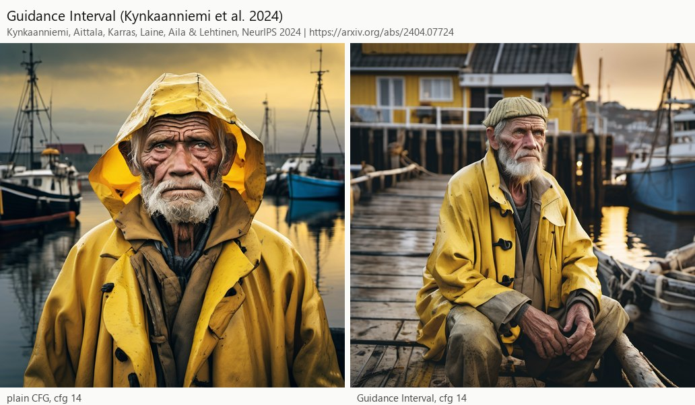

<sub>SDXL; node graph: [docs/showcase/sdxl/GuidanceInterval.json](docs/showcase/sdxl/GuidanceInterval.json). Guidance is off at the highest noise levels, so the composition forms with less guidance: a different layout from plain CFG at the same detail, the paper's intended effect (more variety).</sub>

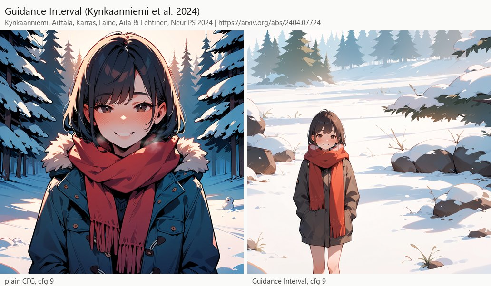

<sub>Anima; node graph: [docs/showcase/anima/GuidanceInterval.json](docs/showcase/anima/GuidanceInterval.json)</sub>

#### Increasing guidance schedules (Wang et al. 2024)

The scale changes over the run while its average stays the sampler's cfg: rising schedules (linear, cosine) worked best, with a floor (paper SDXL 4).

Inputs:

- `shape` (linear up, cosine up, linear down, cosine down, V shape, Lambda shape; default linear up): The schedule's shape.
- `floor` (default 4.0): The scale never falls below this (paper: SDXL 4, SD1.5 2).

Source: Wang, Dufour, Andreou, Cani, Fernandez Abrevaya, Picard & Kalogeiton, arXiv 2024, <https://arxiv.org/abs/2404.13040>. Node id `CFGP_WangSchedules`.

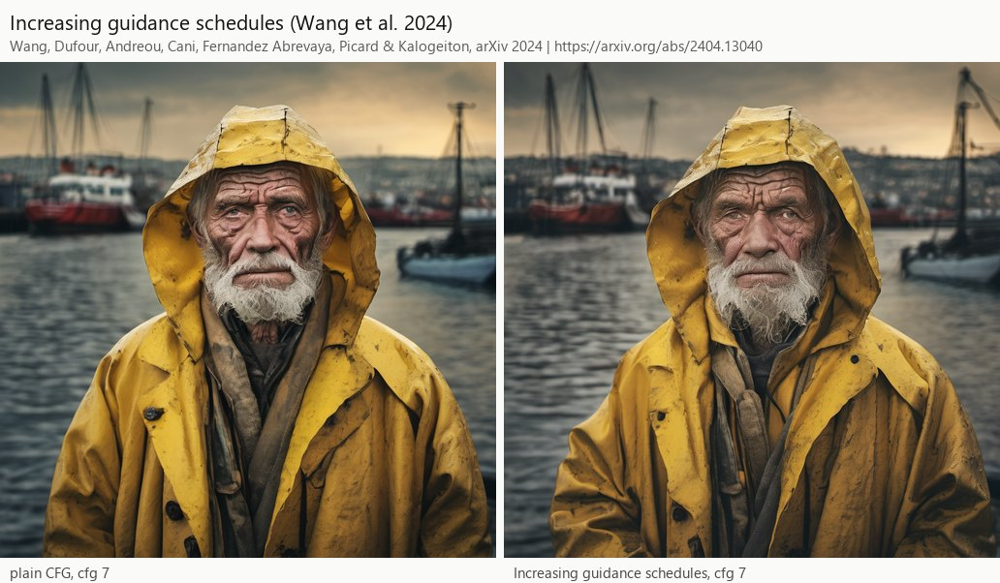

<sub>SDXL; node graph: [docs/showcase/sdxl/WangSchedules.json](docs/showcase/sdxl/WangSchedules.json)</sub>

#### TV-CFG: stage-wise guidance (Jin et al. 2025)

A triangular schedule peaking mid-run (from 1 up to 2w - 1 and back), normalized on the sampler's own steps so the time-average stays w.

Inputs:

- `peak` (default 0.5): Where the peak sits (share of the run; 0.4-0.6 equally good).

Source: Jin, Shi & Gu, ICLR 2026, <https://arxiv.org/abs/2509.22007>. Node id `CFGP_TVCFG`.

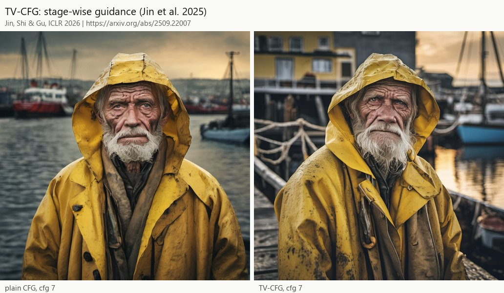

<sub>SDXL; node graph: [docs/showcase/sdxl/TVCFG.json](docs/showcase/sdxl/TVCFG.json)</sub>

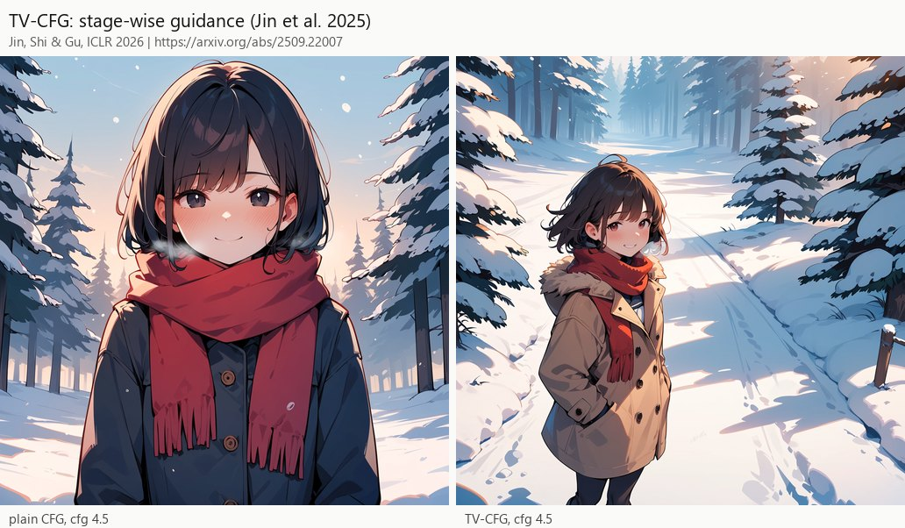

<sub>Anima; node graph: [docs/showcase/anima/TVCFG.json](docs/showcase/anima/TVCFG.json)</sub>

#### C2FG: exponentially growing guidance (Gao et al. 2026)

The scale grows exponentially over the run: w exp(rate (1 - t)), t the noise level.

Inputs:

- `rate` (default 0.693): Growth rate (ln 2 doubles the scale by the end; 0.2 on SD1.5 / SD3.5).

Source: Gao et al., arXiv 2026, <https://arxiv.org/abs/2603.08155>. Node id `CFGP_C2FG`.

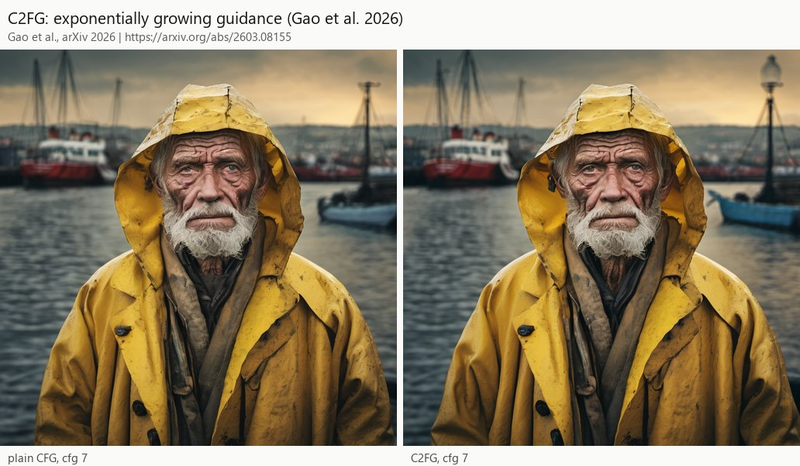

<sub>SDXL; node graph: [docs/showcase/sdxl/C2FG.json](docs/showcase/sdxl/C2FG.json)</sub>

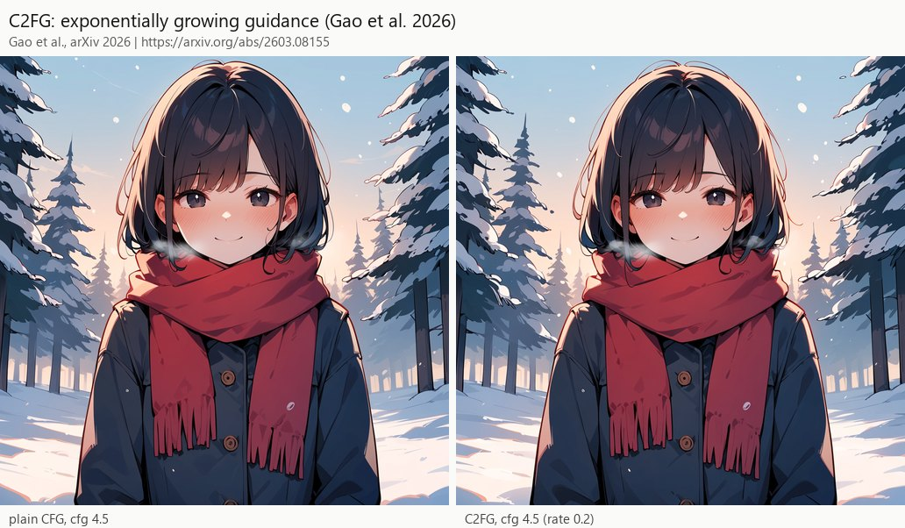

<sub>Anima; node graph: [docs/showcase/anima/C2FG.json](docs/showcase/anima/C2FG.json)</sub>

#### Early-high, late-unconditional (Ventura et al. 2026)

Full guidance early, then a scale of 0 (the unconditional prediction alone) late, which the paper finds reduces distortions. The switch is ComfyUI's percent of the run (by noise level).

Inputs:

- `switch` (default 0.5): Where guidance switches off (paper 50-70% of the steps).
- `late_scale` (default 0.0): The scale after the switch (0 = unconditional, 1 = conditional).

Source: Ventura, Achilli, Ambrogioni & Lucibello, arXiv 2026, <https://arxiv.org/abs/2602.00716>. Node id `CFGP_EarlyHighLateUncond`.

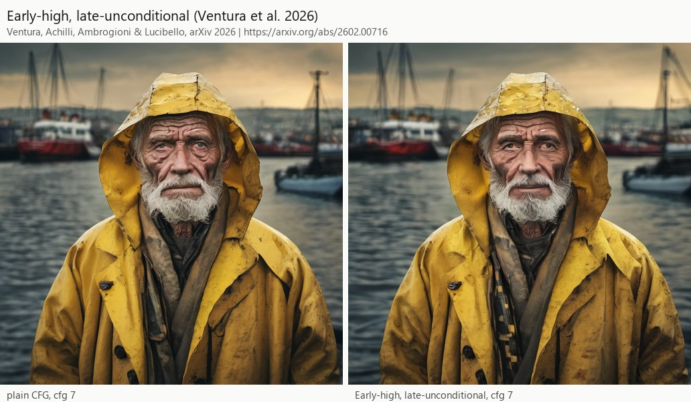

<sub>SDXL; node graph: [docs/showcase/sdxl/EarlyHighLateUncond.json](docs/showcase/sdxl/EarlyHighLateUncond.json)</sub>

#### CFG Truncation (Yi et al. 2024; Lumina-Image 2.0)

Guidance only in the first part of the run, the conditional prediction alone after it (the unconditional pass is skipped there).

Inputs:

- `ratio` (default 0.25): Share of the run with guidance (Lumina 0.25; 0.2-0.6 useful).

Source: Yi, Li, Xin & Li, NeurIPS 2024, <https://arxiv.org/abs/2405.15330>. Node id `CFGP_CFGTruncation`.

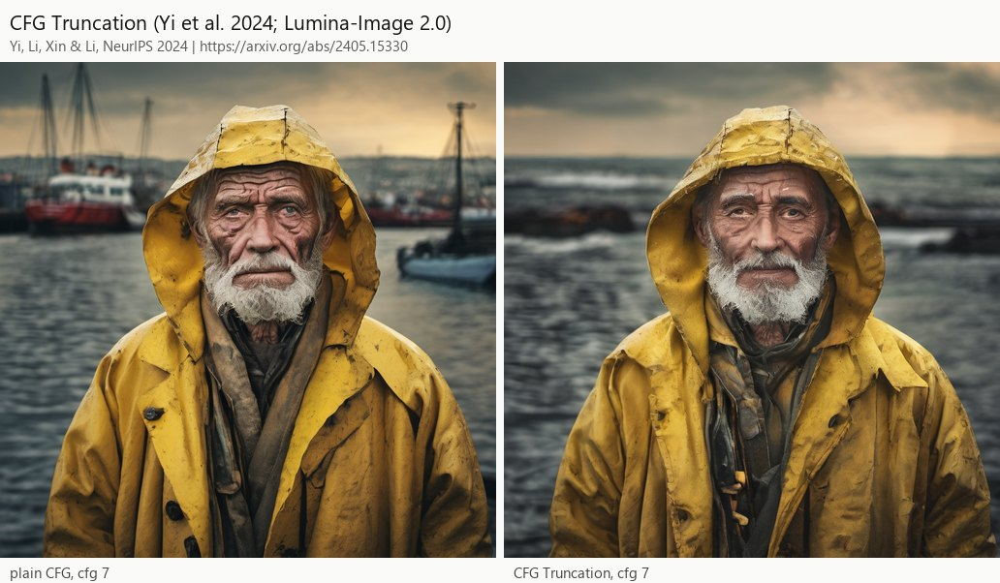

<sub>SDXL; node graph: [docs/showcase/sdxl/CFGTruncation.json](docs/showcase/sdxl/CFGTruncation.json)</sub>

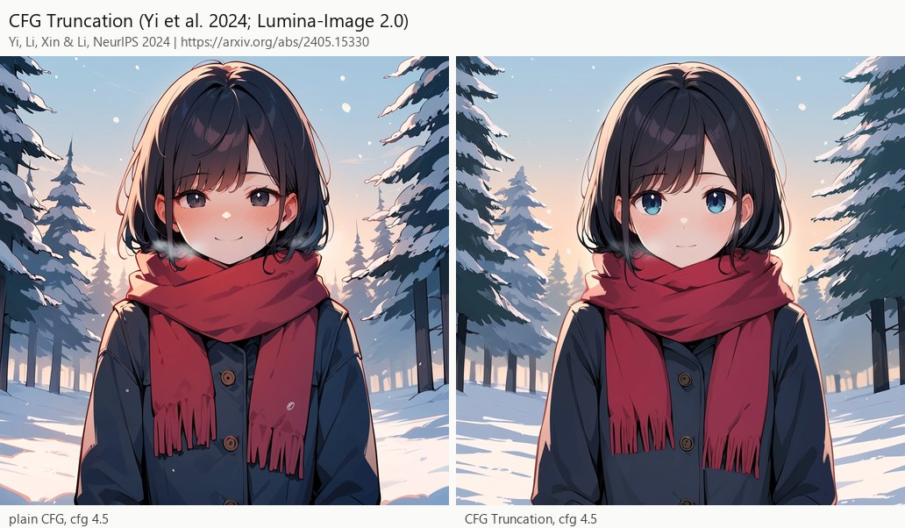

<sub>Anima; node graph: [docs/showcase/anima/CFGTruncation.json](docs/showcase/anima/CFGTruncation.json)</sub>

### Weak branch (a degraded pass of the model itself)

#### PAG: Perturbed-Attention Guidance (Ahn et al. 2024)

One extra pass on the prompt with the chosen self-attention replaced by the identity (each token sees only itself), and guidance away from it on top of CFG: + s (c - pag). SDXL and SD1.5 (UNets).

Inputs:

- `scale` (default 3.0): Strength s (1.5-5; 1.5 when CFG is also on).
- `blocks` (middle (PAG / SEG default), middle + first output, deep output (output 0-2), deep input (input 7-8), all SDXL attention blocks; default middle (PAG / SEG default)): Which self-attention blocks are perturbed (SDXL names; the middle block exists on SD1.5 too). On Anima and other Cosmos-Predict2 transformers: middle = the two middle blocks, deep input = the first third, deep output = the last third.

Source: Ahn et al., ECCV 2024, <https://arxiv.org/abs/2403.17377>. Node id `CFGP_PAG`.

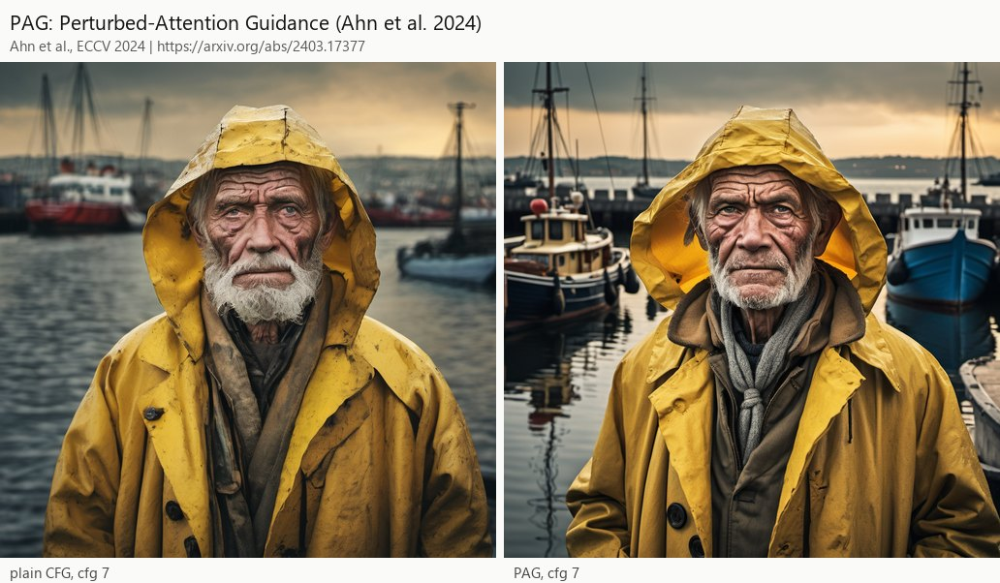

<sub>SDXL; node graph: [docs/showcase/sdxl/PAG.json](docs/showcase/sdxl/PAG.json)</sub>

#### SEG: Smoothed Energy Guidance (Hong 2024)

One extra pass with the chosen self-attention queries blurred over the image (a flatter attention energy), and guidance away from it: + s (c - seg). SDXL, SD1.5 and Anima.

Inputs:

- `scale` (default 3.0): Strength s (paper 3).
- `blur_sigma` (default 10.0): Blur in tokens (100 = infinite: every query is the mean).
- `blocks` (middle (PAG / SEG default), middle + first output, deep output (output 0-2), deep input (input 7-8), all SDXL attention blocks; default middle (PAG / SEG default)): Which self-attention blocks are perturbed (SDXL names; the middle block exists on SD1.5 too). On Anima and other Cosmos-Predict2 transformers: middle = the two middle blocks, deep input = the first third, deep output = the last third.

Source: Hong, NeurIPS 2024, <https://arxiv.org/abs/2408.00760>. Node id `CFGP_SEG`.

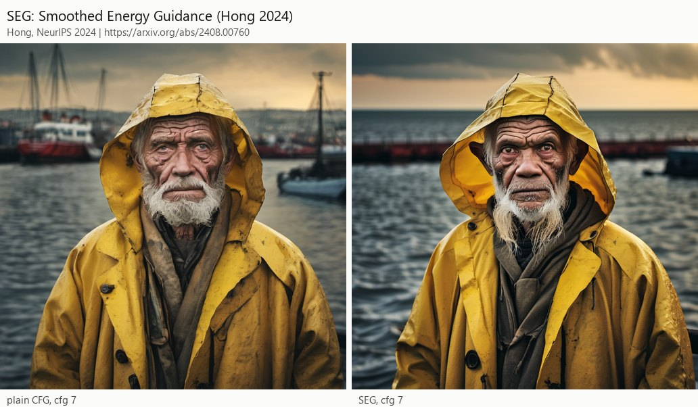

<sub>SDXL; node graph: [docs/showcase/sdxl/SEG.json](docs/showcase/sdxl/SEG.json)</sub>

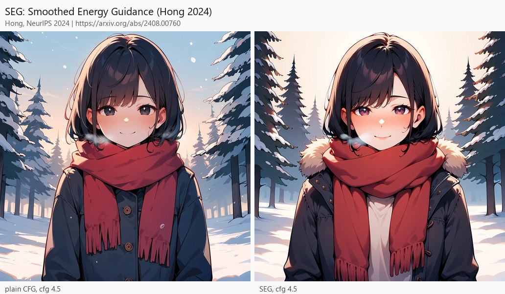

<sub>Anima; node graph: [docs/showcase/anima/SEG.json](docs/showcase/anima/SEG.json)</sub>

#### STG: Spatiotemporal Skip Guidance, attention skip (Hyung et al. 2025)

One extra pass with the chosen self-attention layers skipped (they add nothing), and guidance away from it: + s (c - skip). The self-attention form of STG's layer skip; exact on Anima, whose attention carries no bias. SDXL, SD1.5 and Anima.

Inputs:

- `scale` (default 1.0): Strength s (paper 1 for the residual skip).
- `blocks` (middle (PAG / SEG default), middle + first output, deep output (output 0-2), deep input (input 7-8), all SDXL attention blocks; default middle (PAG / SEG default)): Which self-attention blocks are perturbed (SDXL names; the middle block exists on SD1.5 too). On Anima and other Cosmos-Predict2 transformers: middle = the two middle blocks, deep input = the first third, deep output = the last third.

Source: Hyung, Kim, Hong, Kim & Choo, CVPR 2025, <https://arxiv.org/abs/2411.18664>. Node id `CFGP_STG`.

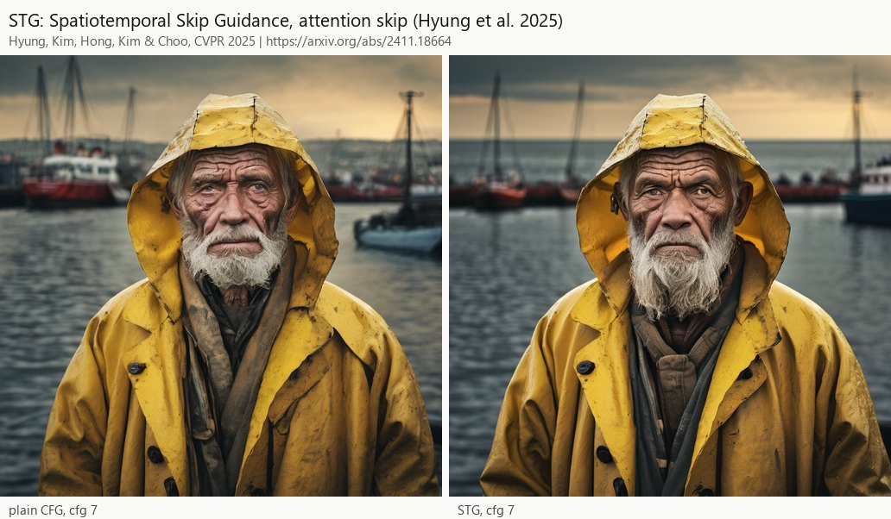

<sub>SDXL; node graph: [docs/showcase/sdxl/STG.json](docs/showcase/sdxl/STG.json)</sub>

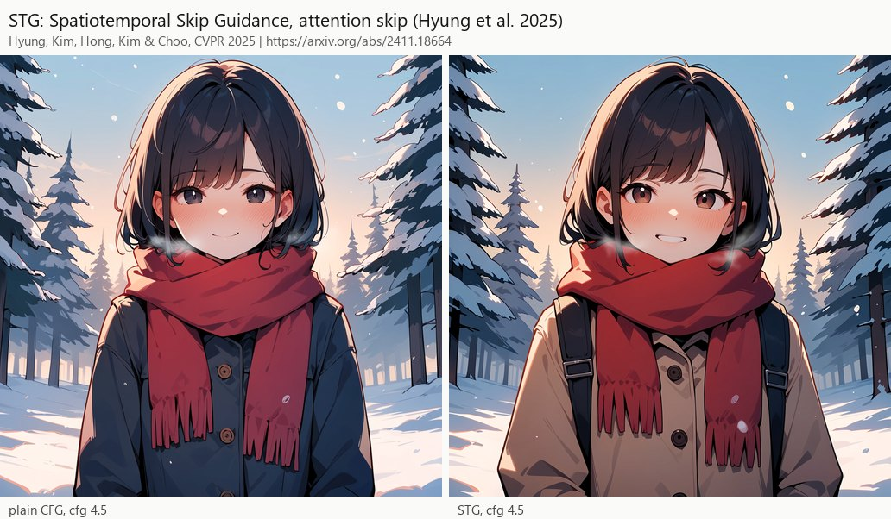

<sub>Anima; node graph: [docs/showcase/anima/STG.json](docs/showcase/anima/STG.json)</sub>

### Negative prompts (guiders)

#### Perp-Neg Guider (Armandpour et al. 2023)

Uses only the part of the negative's direction that is perpendicular to the positive's, so a negative cannot cancel what the prompt asks for: u + w ((c - u) - s perp(n - u)).

A guider for SamplerCustomAdvanced. Inputs:

- `positive`, `negative`, `null` (an empty prompt), `cfg`
- `space`: where the rule is computed (default: auto, the method's own)
- `neg_scale` (default 1.0): Weight of the perpendicular negative (paper 1.5 for one negative).

Source: Armandpour, Sadeghian, Zheng, Sadeghian & Zhou, arXiv 2023, <https://arxiv.org/abs/2304.04968>. Node id `CFGP_PerpNeg`.

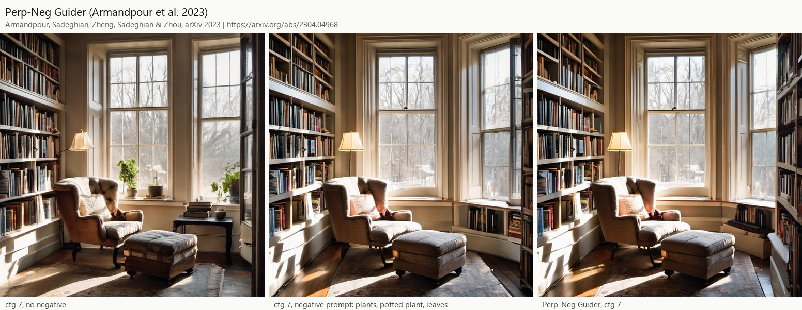

<sub>SDXL; node graph: [docs/showcase/sdxl/PerpNeg.json](docs/showcase/sdxl/PerpNeg.json). Only the part of the negative that the prompt does not share is removed. This prompt does not ask for plants, so they go, much as with the plain negative prompt.</sub>

#### Composable NOT Guider (Liu et al. 2022)

Composable diffusion's negation: u + w (c - n), the null prompt as the base and the negative as the direction to leave.

A guider for SamplerCustomAdvanced. Inputs:

- `positive`, `negative`, `null` (an empty prompt), `cfg`
- `space`: where the rule is computed (default: auto, the method's own)

Source: Liu, Li, Du, Torralba & Tenenbaum, ECCV 2022, <https://arxiv.org/abs/2206.01714>. Node id `CFGP_ComposableNOT`.

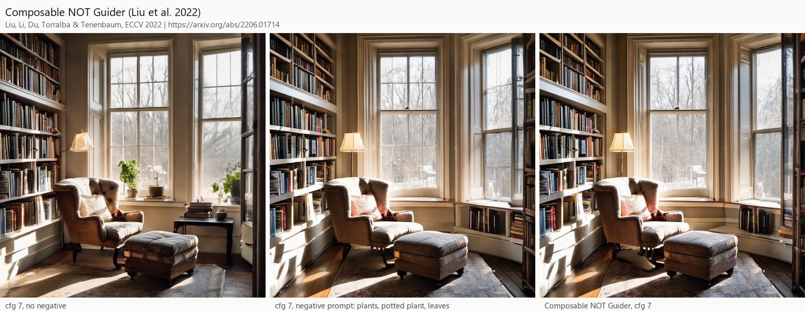

<sub>SDXL; node graph: [docs/showcase/sdxl/ComposableNOT.json](docs/showcase/sdxl/ComposableNOT.json)</sub>

#### Signed guidance: positive and negative from the null (A1111 AND; VL-DNP, Chang et al. 2025)

Both prompts measured from the empty prompt: u + w (c - u) - w_neg (n - u).

A guider for SamplerCustomAdvanced. Inputs:

- `positive`, `negative`, `null` (an empty prompt), `cfg`
- `space`: where the rule is computed (default: auto, the method's own)
- `w_neg` (default 5.0): Weight of the negative direction (w_neg = w is composable NOT).

Source: AUTOMATIC1111 AND with negative weights; Chang, Kim & Choi, arXiv 2025, <https://arxiv.org/abs/2510.26052>. Node id `CFGP_SignedGuidance`.

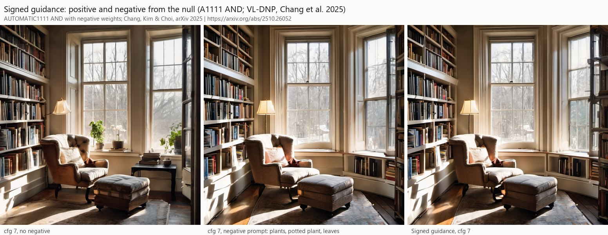

<sub>SDXL; node graph: [docs/showcase/sdxl/SignedGuidance.json](docs/showcase/sdxl/SignedGuidance.json)</sub>

#### ContrastiveCFG Guider (Chang et al. 2024)

Positive and negative directions weighted by how far each already is from the null: more push while the positive is weak, less negative once the negative is far.

A guider for SamplerCustomAdvanced. Inputs:

- `positive`, `negative`, `null` (an empty prompt), `cfg`
- `space`: where the rule is computed (default: auto, the method's own)
- `w_neg` (default -1.0): Negative weight (-1 = w).
- `tau` (default -1.0): Temperature (-1 = calibrated per image).

Source: Chang, Lee, Chung & Ye, ICML 2026, <https://arxiv.org/abs/2411.17077>. Node id `CFGP_ContrastiveCFG`.

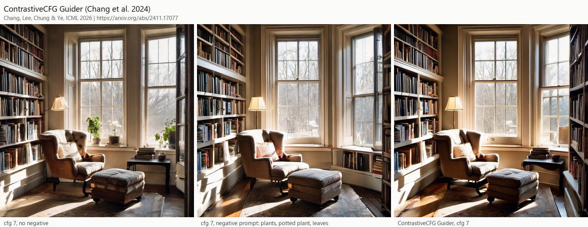

<sub>SDXL; node graph: [docs/showcase/sdxl/ContrastiveCFG.json](docs/showcase/sdxl/ContrastiveCFG.json)</sub>

#### Safe Latent Diffusion Guider (Schramowski et al. 2023)

Steers away from a concept (the negative prompt) only where the image moves toward it, with momentum and a warm-up; the paper's medium, strong and max settings.

A guider for SamplerCustomAdvanced. Inputs:

- `positive`, `negative`, `null` (an empty prompt), `cfg`
- `space`: where the rule is computed (default: auto, the method's own)
- `preset` (medium, strong, max; default medium): The paper's configurations.

Source: Schramowski, Brack, Deiseroth & Kersting, CVPR 2023, <https://arxiv.org/abs/2211.05105>. Node id `CFGP_SafeLatentDiffusion`.

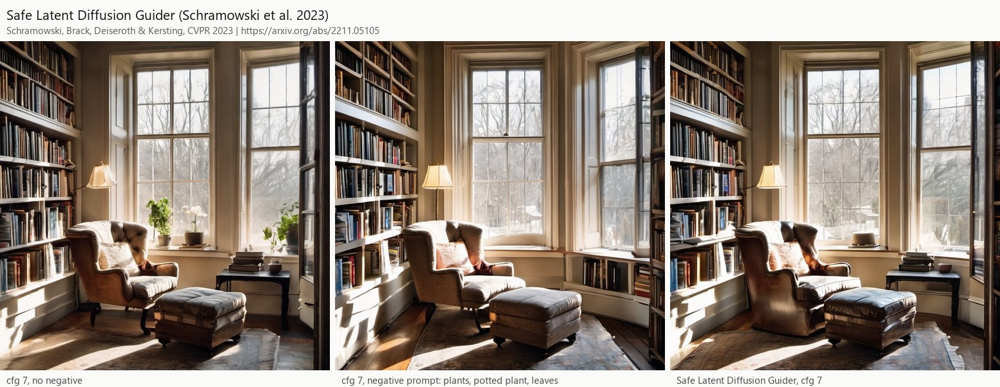

<sub>SDXL; node graph: [docs/showcase/sdxl/SafeLatentDiffusion.json](docs/showcase/sdxl/SafeLatentDiffusion.json). From the 10th step on it steers away from the concept only where the image moves toward it: the plants go and the layout of the run without a negative stays.</sub>

#### Windowed negative prompt (Ban et al. 2024)

The negative prompt replaces the empty prompt only inside a window of the run: nouns need it from about step 5 of 30, adjectives from about 10.

A guider for SamplerCustomAdvanced. Inputs:

- `positive`, `negative`, `null` (an empty prompt), `cfg`
- `space`: where the rule is computed (default: auto, the method's own)
- `start` (default 0.17): Where the negative starts (share of the run).
- `end` (default 0.5): Where it ends (1 = to the end: a delayed negative).

Source: Ban, Wang, Zhou, Cheng, Gong & Hsieh, ECCV 2024, <https://arxiv.org/abs/2406.02965>. Node id `CFGP_WindowedNegative`.

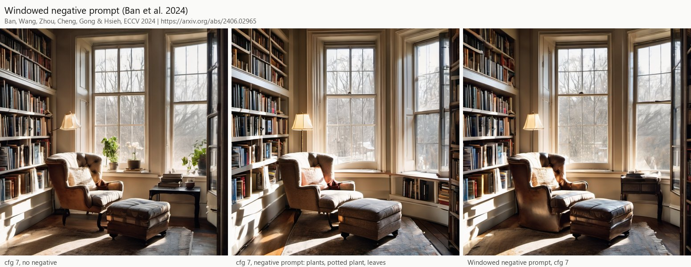

<sub>SDXL; node graph: [docs/showcase/sdxl/WindowedNegative.json](docs/showcase/sdxl/WindowedNegative.json). The negative acts only from 17% to 50% of the run, after the layout has formed: the plants go and the layout of the run without a negative stays.</sub>

### Frequency and space

#### SAMG: spatially adaptive guidance (Li et al. 2026)

A scale per pixel: pixels where the guidance difference has high energy get the low scale, calm pixels the high one.

Inputs:

- `scale`: the guidance scale (-1 = the sampler's cfg)
- `space`: where the rule is computed (default: auto, the method's own)
- `w_min` (default -1.0): Scale at high-energy pixels (-1 = w 2/3).
- `w_max` (default -1.0): Scale at calm pixels (-1 = w 1.6).

Source: Li et al., arXiv 2026, <https://arxiv.org/abs/2604.26503>. Node id `CFGP_SAMG`.

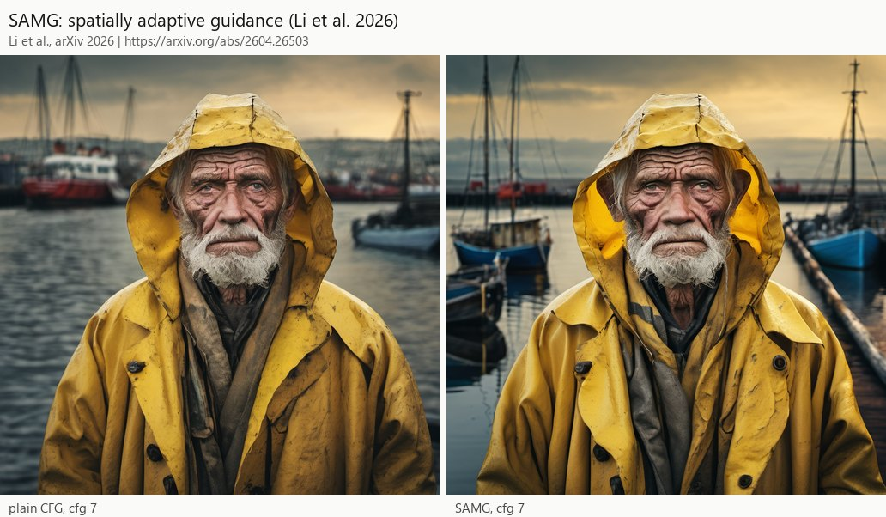

<sub>SDXL; node graph: [docs/showcase/sdxl/SAMG.json](docs/showcase/sdxl/SAMG.json)</sub>

#### FDG: Frequency-Decoupled Guidance (Sadat et al. 2025)

A Laplacian pyramid of both predictions, guided per level: the full scale on fine detail, a lower one on coarse structure (color and layout), which avoids over-saturation.

Inputs:

- `scale`: the guidance scale (-1 = the sampler's cfg)
- `space`: where the rule is computed (default: auto, the method's own)
- `w_low` (default -1.0): Scale on the coarsest level (-1 = w / 2).
- `levels` (default 2): Pyramid levels.
- `parallel_weight` (default 1.0): Weight of each level's part along the conditional (1 = none removed).
- `formulation` (paper, diffusers; default paper): Identical at parallel_weight 1.

Source: Sadat, Vontobel, Salehi & Weber, arXiv 2025, <https://arxiv.org/abs/2506.19713>. Node id `CFGP_FDG`.

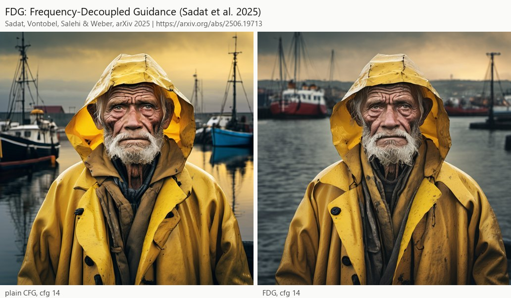

<sub>SDXL; node graph: [docs/showcase/sdxl/FDG.json](docs/showcase/sdxl/FDG.json)</sub>

#### FreSca: Fourier band scaling (Huang et al. 2025)

The guidance difference is split in the Fourier domain and its low and high bands scaled separately.

Inputs:

- `scale`: the guidance scale (-1 = the sampler's cfg)
- `space`: where the rule is computed (default: auto, the method's own)
- `scale_low` (default 1.0): Low-band factor.
- `scale_high` (default 1.25): High-band factor (paper SDXL 1.5).
- `freq_cutoff` (default 20): Band edge, in frequency bins.

Source: Huang et al., arXiv 2025, <https://arxiv.org/abs/2504.02154>. Node id `CFGP_FreSca`.

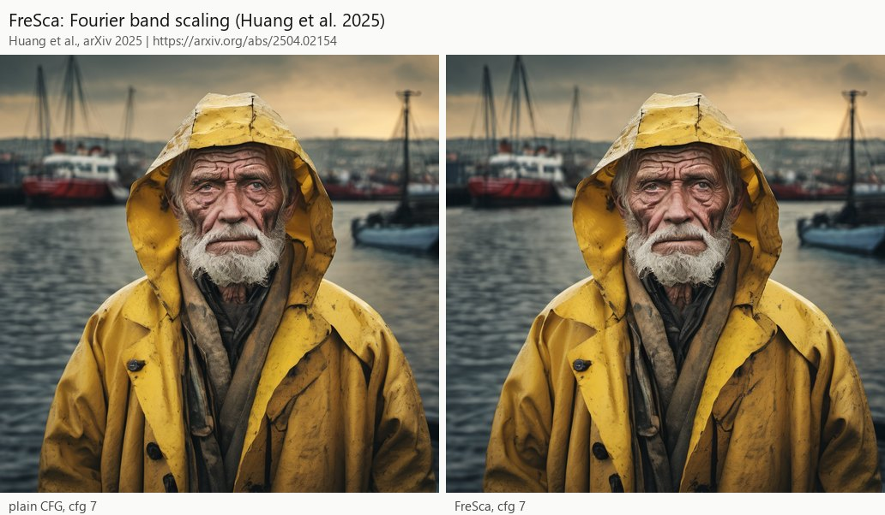

<sub>SDXL; node graph: [docs/showcase/sdxl/FreSca.json](docs/showcase/sdxl/FreSca.json)</sub>

#### HiWave: wavelet detail guidance (Vontobel et al. 2025)

One wavelet level: guidance on the detail bands only, the coarse band left conditional (w_low 1). (The paper's upscaling pipeline is not part of this node.)

Inputs:

- `scale`: the guidance scale (-1 = the sampler's cfg)
- `space`: where the rule is computed (default: auto, the method's own)
- `w_low` (default 1.0): Scale on the coarse band (1 = conditional).
- `wavelet` (haar, sym4; default sym4): The wavelet.

Source: Vontobel, Sadat, Salehi & Weber, SIGGRAPH Asia 2025, <https://arxiv.org/abs/2506.20452>. Node id `CFGP_HiWave`.

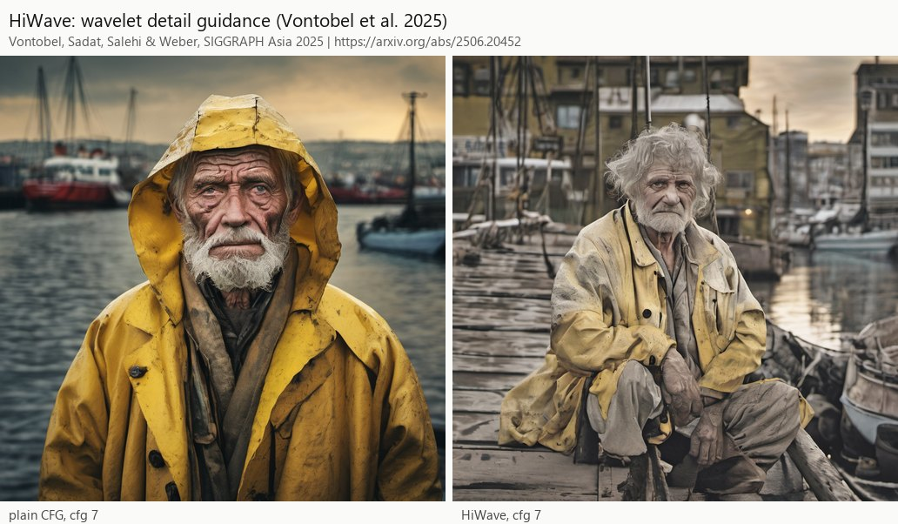

<sub>SDXL; node graph: [docs/showcase/sdxl/HiWave.json](docs/showcase/sdxl/HiWave.json). Used alone, only the detail bands are guided and the coarse band (layout and color) runs at scale 1, so layout and color come out unguided. In the paper the layout comes from a base image that is upscaled and inverted first; this node is the guidance rule of that pipeline.</sub>

#### LF-CFG: low-frequency improved CFG (Song & Lai 2025)

Finds the slowly changing low-frequency regions of the guidance (redundant between steps) and scales them down; the rest gets plain CFG.

Inputs:

- `scale`: the guidance scale (-1 = the sampler's cfg)
- `space`: where the rule is computed (default: auto, the method's own)
- `rho` (default 0.5): Scale on the slow low-frequency part (1 = plain CFG).
- `k` (default 8): Low-pass downsampling factor.

Source: Song & Lai, arXiv 2025, <https://arxiv.org/abs/2506.21452>. Node id `CFGP_LFCFG`.

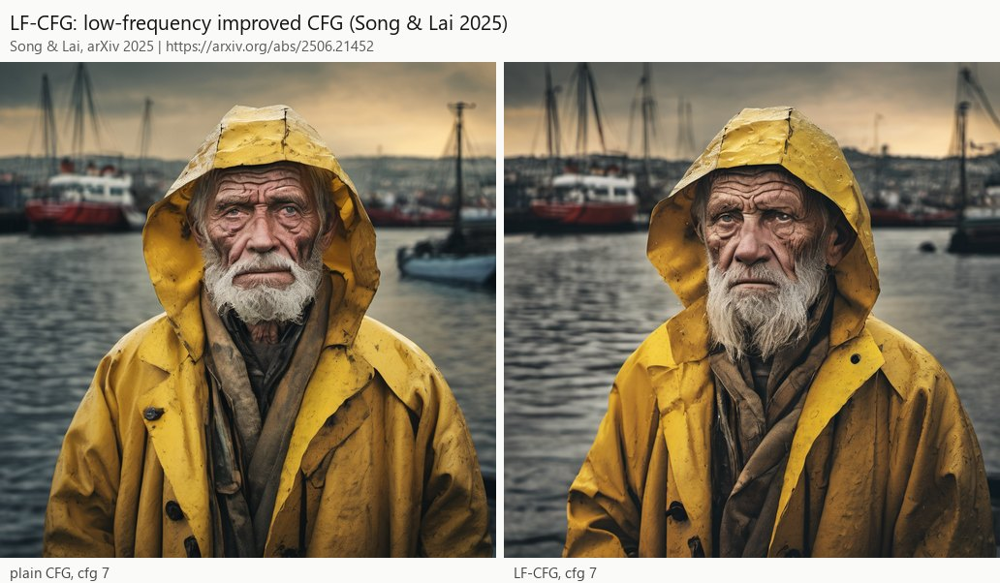

<sub>SDXL; node graph: [docs/showcase/sdxl/LFCFG.json](docs/showcase/sdxl/LFCFG.json)</sub>

#### ZeResFDG (CADE 2.5; Rychkovskiy 2025)

Frequency-decoupled guidance with rescale and zero-projection, switching between them by how much of the guidance sits at high frequencies.

Inputs:

- `scale`: the guidance scale (-1 = the sampler's cfg)
- `space`: where the rule is computed (default: auto, the method's own)
- `mode` (auto, cfgzero_fd, rescale_fdg; default auto): auto switches by the high-frequency share.
- `lam_low` (default 0.6): Low-band weight.
- `lam_high` (default 1.3): High-band weight.
- `rescale_mix` (default 0.7): Rescale blend.
- `blur_sigma` (default 1.0): Low-pass blur.

Source: Rychkovskiy, arXiv 2025, <https://arxiv.org/abs/2510.12954>. Node id `CFGP_ZeResFDG`.

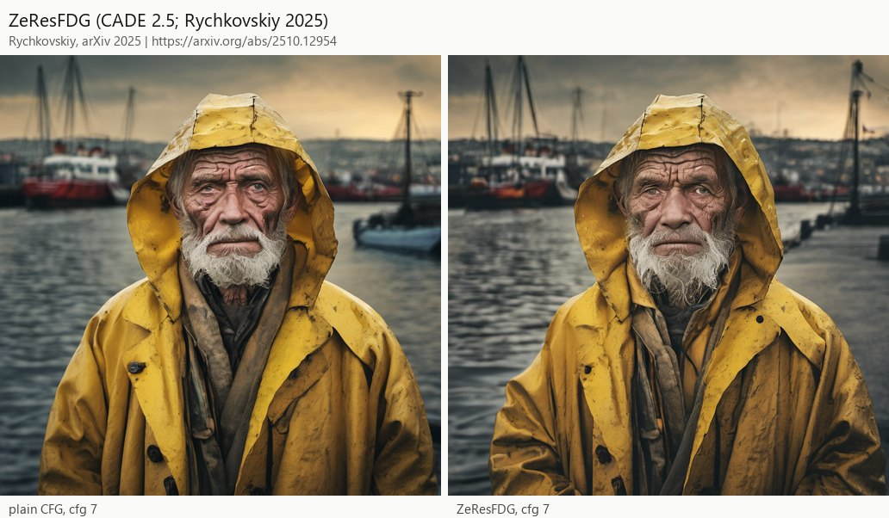

<sub>SDXL; node graph: [docs/showcase/sdxl/ZeResFDG.json](docs/showcase/sdxl/ZeResFDG.json)</sub>
<!-- paper-sections:end -->

## Recipes

| Goal | Chain |
|---|---|
| high scale without burnt colors | APG, or any combine rule followed by CFG Correct: Magnitude (rescale_std 0.7) |
| strong prompt adherence, calm composition | CFG When (cosine_down over 0 to 0.3, outside = base scale) + Direction Rules (angle_limit) + Frequency Bands (high 1.2) |
| guidance only where it helps | Guidance Interval (sigma 0.28 to 5.42 on SDXL) at cfg 12 to 16 |
| detail without extra passes | HiGS, or Frequency Bands with high_multiplier above 1 |
| sharper structure from the model itself | SEG or PAG (add mode, scale 1.5 to 3) on top of cfg 4 to 7 |
| a negative that does not fight the prompt | Perp-Neg guider with an empty null prompt |
| a leash on how far guidance turns the image | any chain + CFG Govern: Angle Band (max 20 to 30 degrees) |
| Anima | the paper nodes work as on SDXL; the weak branch uses SEG or STG; the guidance interval converts its bounds to flow noise levels by itself |

## Troubleshooting

- **Nothing changes.** Check the Plan Readout: another pack's CFG-function node (RescaleCFG, Mahiro, RenormCFG)
  chained after this pack's nodes takes the single CFG-function slot. Chain it before, or use this pack's version.
- **A weak-branch node stops on Anima.** PAG and the attention temperature need the attention output replaced,
  which Anima's blocks do not allow; use SEG or STG.
- **The first image of an A/B pair differs slightly from a later rerun.** ComfyUI rounds its first sampling after a
  model load differently; queue once with another seed first.
- **Norm-dependent methods look over- or under-guided** (power-law CFG, beta-CFG with gamma 1). Their effective
  scale depends on the size of `c - u`, which changes with the model and the resolution; the showcase used omega
  2.42 and scale 19.2 on SDXL at 1024 x 1024, where that size was about 2.7 in noise units.
- **A paper node greys or wrecks SDXL images but works on a flow model.** Many recent methods were tuned on flow
  models (SD3.5, Flux). On SDXL's noise predictions a per-element constant is multiplied by the noise level (up to
  14.6), and the denoised estimates of the first steps sit far apart, so absolute constants, angle caps and norm
  caps act harder there. The notes under the images name the cases found (ADG, PMC-CFG, SMC-CFG); SMC-CFG's `k`
  and Adaptive Guidance's cosine already adapt by default.
