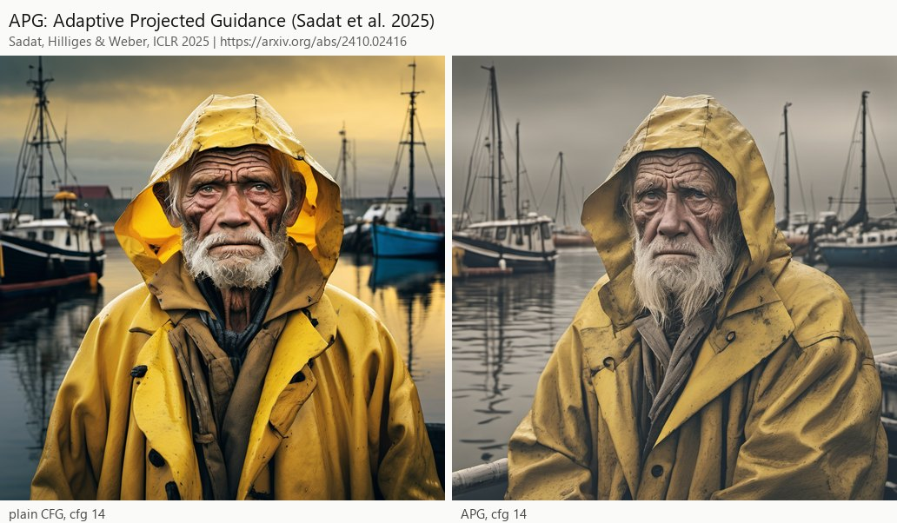

# CFG Megapack for ComfyUI

Classifier-free guidance, taken apart. Every guided sampling step is split into seven stages (when to guide, a weak
branch, how to combine the predictions, where to guide, magnitude correction, an angle governor, and measurement),
with one node per stage, so a structural idea can be tried by swapping one node while everything else stays fixed.
On the same engine sit **50 paper nodes**, one per published guidance method (APG, CFG-Zero*, PAG, SEG, Perp-Neg,
FDG, the guidance interval, and 43 more), each with its paper's own settings and defaults. Paper nodes and stage
nodes chain freely.

Works on SDXL and on flow-matching models: Anima (Cosmos-Predict2 architecture, 16-channel latents, timestep shift 3)
is supported throughout, including the weak-branch methods that suit its transformer blocks (SEG and attention
skip). SD1.5 uses the same UNet hooks as SDXL. The pack needs nothing beyond ComfyUI itself.



## Install

**ComfyUI-Manager:** search for **CFG Megapack** in the Custom Nodes Manager, install, restart ComfyUI. The pack is
on the [Comfy Registry](https://registry.comfy.org/nodes/comfy-cfg-megapack) as `comfy-cfg-megapack`, so comfy-cli
installs it too: `comfy node install comfy-cfg-megapack`.

**From the Git URL:** Manager > Install via Git URL > `https://github.com/AbstractEyes/comfy-cfg-megapack` (Manager
4.x allows this only with `allow_git_url_install = true` in the `[default]` section of its `config.ini`, in
`ComfyUI/user/__manager/`).

**By hand:**

```
cd ComfyUI/custom_nodes
git clone https://github.com/AbstractEyes/comfy-cfg-megapack
```

Restart ComfyUI. There is no requirements.txt because nothing extra is needed: the pack uses torch and the Python
standard library, which ComfyUI already has. It uses ComfyUI's current node API (`comfy_api.latest`); tested on
ComfyUI 0.38.0 with torch 2.11 (CUDA 12.8), on the GPU and CPU-only.

Optional: on a shared GPU, set `CFG_MEGAPACK_VRAM_FRACTION` (for example `0.6`) before starting ComfyUI to cap its
share of GPU memory.

## Quick start

1. Open **Workflow > Browse Templates**, then **Custom Nodes > comfy-cfg-megapack**, or drag a file from
   `example_workflows/` onto the canvas. Every example renders two images from one seed: plain CFG and the variant.
2. The shortest chain: **Load Checkpoint > (any CFG Megapack node) > KSampler**. The node patches the MODEL; the
   sampler's cfg is the guidance scale unless the node sets its own.
3. Chain more nodes between the loader and the sampler to combine stages, for example a schedule, APG and the
   angle governor. **CFG Plan Readout** shows the whole plan on a model.

[HOWTO.md](HOWTO.md) describes every node, every workflow, and how to drive the multi-rule nodes.

## How it works: seven stages

At every step the model gives a conditional prediction `c` and an unconditional one `u`. Plain CFG is
`u + w (c - u)`. The stages always run in this order, whatever order the nodes are chained in:

| # | Stage | Stage node(s) | What it decides |
|---|---|---|---|
| 1 | When | CFG When: Schedule and Window | how the scale changes over the run, and where guidance is on at all |
| 2 | Weak branch | CFG Weak Branch: Perturbed Self-Attention | an extra pass of the model with some self-attention degraded, to guide away from |
| 3 | Combine | CFG Mix: Scale Rules, Direction Rules, Pentachoron | how `c` and `u` become one prediction |
| 4 | Where | CFG Where: Frequency Bands, Region Mask | how strongly guidance acts on coarse versus fine detail, and inside versus outside a mask |
| 5 | Correct | CFG Correct: Magnitude | pulls the result's size back toward the conditional prediction (against over-saturation) |
| 6 | Govern | CFG Govern: Angle Band | holds the angle between the result and its home inside a band: the last word on direction |
| 7 | Measure | CFG Measure: Per-Step Probe | writes per-step numbers (scale, sizes, angles) to `output/cfg_probe/` |

Plus **CFG Plan Readout**, **CFG Clear Plan**, and **CFG Guider: Positive, Negative and Null**, a guider for
SamplerCustomAdvanced that keeps the negative prompt apart from the true unconditional (the empty prompt).

Rules of the chain:

- A later node of the same stage replaces an earlier one; corrections are the exception and stack in order.
- A paper node writes the stage its method belongs to: most write stage 3, the schedules write stage 1, PAG, SEG
  and STG write stage 2, and the negative-prompt papers are guiders.
- With neutral settings every node reproduces plain sampling pixel for pixel. The guidance is handed to the sampler
  exactly, the space conversions run in float64, and factors of 1 skip their arithmetic.
- Other packs' CFG-function nodes (RescaleCFG, Mahiro, RenormCFG) share ComfyUI's single CFG-function slot with
  this pack: the one chained last wins. Pre- and post-CFG nodes (CFGZeroStar, CFGNorm, APG, TCFG, PAG, SAG, SLG)
  compose with it.

## The paper nodes

One node per paper, named after it. The menu folder is **CFG Megapack > papers >** the research line. Each node's
description gives the rule in plain words and the source; the settings start at the paper's own values.

<!-- papers-table:begin -->
**Combining the two predictions** (27)

| Node | Source | What it does |
|---|---|---|
| [CFG: Classifier-Free Guidance (Ho & Salimans 2022)](HOWTO.md#cfg-classifier-free-guidance-ho--salimans-2022) | [Ho & Salimans, NeurIPS 2021 workshop / arXiv 2022](https://arxiv.org/abs/2207.12598) | The baseline every other node reshapes: u + w (c - u), the conditional prediction pushed away from the unconditional one by the scale w. |
| [Guidance Rescale (Lin et al. 2024)](HOWTO.md#guidance-rescale-lin-et-al-2024) | [Lin, Liu, Li & Yang, WACV 2024](https://arxiv.org/abs/2305.08891) | Plain CFG, then its per-image standard deviation is pulled back to the conditional prediction's: x = phi * cfg * std(c) / std(cfg) + (1 - phi) * cfg. |
| [Dynamic Thresholding (Imagen; Saharia et al. 2022)](HOWTO.md#dynamic-thresholding-imagen-saharia-et-al-2022) | [Saharia et al., NeurIPS 2022](https://arxiv.org/abs/2205.11487) | Plain CFG on the denoised image, then each image is clipped to its p-th percentile of absolute values (at least s_max) and divided by it, which keeps pixel values in range at high scales. |
| [Mimic-Scale Thresholding (mcmonkey 2023)](HOWTO.md#mimic-scale-thresholding-mcmonkey-2023) | [mcmonkey4eva, sd-dynamic-thresholding (community)](https://github.com/mcmonkeyprojects/sd-dynamic-thresholding) | Runs CFG at a high real scale (the sampler's cfg, 15-30) and rescales it per channel so its spread matches CFG at the low mimic scale: the prompt adherence of a high scale with the colors of a low one. |
| [APG: Adaptive Projected Guidance (Sadat et al. 2025)](HOWTO.md#apg-adaptive-projected-guidance-sadat-et-al-2025) | [Sadat, Hilliges & Weber, ICLR 2025](https://arxiv.org/abs/2410.02416) | Splits the guidance difference g = c - u into its part along c and the rest, keeps the rest, down-weights the part along c (eta), caps the norm of g and adds reverse momentum: high scales without over-saturation. |
| [CFG-Zero* (Fan et al. 2025)](HOWTO.md#cfg-zero-fan-et-al-2025) | [Fan, Zheng, Yeh & Liu, arXiv 2025](https://arxiv.org/abs/2503.18886) | Scales the unconditional prediction to best fit the conditional one first, s* = <c, u> / ||u||^2, then s* u + w (c - s* u); the first steps can leave the latent unmoved (zero-init). |
| [TCFG: Tangential Damping CFG (Kwon et al. 2025)](HOWTO.md#tcfg-tangential-damping-cfg-kwon-et-al-2025) | [Kwon, Kim, Jeong, Hsiao & Uh, CVPR 2025](https://arxiv.org/abs/2503.18137) | Removes the part of the unconditional prediction that lies off the main direction shared by both predictions (a rank-one projection from their 2 x N matrix), then plain CFG. |
| [beta-CFG (Malarz et al. 2025)](HOWTO.md#beta-cfg-malarz-et-al-2025) | [Malarz, Kasymov, Zieba, Tabor & Spurek, ECAI 2025](https://arxiv.org/abs/2502.10574) | A Beta-shaped schedule over the run with the guidance difference normalized: u + w * Beta(p; a, b) * (c - u) / ||c - u||^gamma. |
| [ADG: Angle Domain Guidance (Jin et al. 2025)](HOWTO.md#adg-angle-domain-guidance-jin-et-al-2025) | [Jin, Xiao, Liu & Gu, ICML 2025](https://arxiv.org/abs/2506.11039) | Guides by angle instead of length: the denoised prediction turns away from the unconditional one by (w - 1) times their angle, capped at a maximum, which bounds the norm of the result. |
| [Power-Law CFG (Lehman Pavasovic et al. 2025)](HOWTO.md#power-law-cfg-lehman-pavasovic-et-al-2025) | [Lehman Pavasovic, Verbeek, Biroli & Mezard, arXiv 2025](https://arxiv.org/abs/2502.07849) | The scale grows with the size of the difference: c + omega ||c - u||^alpha (c - u). |
| [EP-CFG: Energy-Preserving CFG (Zhang et al. 2024)](HOWTO.md#ep-cfg-energy-preserving-cfg-zhang-et-al-2024) | [Zhang, Luan, Bi & Zhang, arXiv 2024](https://arxiv.org/abs/2412.09966) | Plain CFG rescaled so its energy (sum of squares) equals the conditional prediction's; the robust form counts only the middle percentiles of the squared values. |
| [CFG-Renorm (Qin et al. 2025; Lumina-Image 2.0)](HOWTO.md#cfg-renorm-qin-et-al-2025-lumina-image-20) | [Qin et al., arXiv 2025 (after STIV)](https://arxiv.org/abs/2503.21758) | Plain CFG, then its norm is capped at rho times the conditional prediction's norm. |
| [CFGNorm: per-pixel norm matching (Qwen-Image)](HOWTO.md#cfgnorm-per-pixel-norm-matching-qwen-image) | [Qwen-Image pipeline; ComfyUI CFGNorm (no paper)](https://github.com/QwenLM/Qwen-Image) | Plain CFG with each pixel's channel vector rescaled to the conditional prediction's length (match) or only shortened when longer (attenuate). |
| [MAMBO-G: magnitude-aware guidance damping (Zhu et al. 2025)](HOWTO.md#mambo-g-magnitude-aware-guidance-damping-zhu-et-al-2025) | [Zhu et al., arXiv 2025](https://arxiv.org/abs/2508.03442) | The scale shrinks where the difference is large relative to the unconditional prediction: w_eff = 1 + (w - 1) exp(-alpha ||c - u|| / ||u||). |
| [Skimmed CFG (Extraltodeus)](HOWTO.md#skimmed-cfg-extraltodeus) | [Extraltodeus, Skimmed_CFG (community)](https://github.com/Extraltodeus/Skimmed_CFG) | Where guidance would push a value past both predictions in the same direction, that value is pulled back to what a lower skimming scale would give; lets high scales run without burning. |
| [Automatic CFG (Extraltodeus)](HOWTO.md#automatic-cfg-extraltodeus) | [Extraltodeus, ComfyUI-AutomaticCFG (community)](https://github.com/Extraltodeus/ComfyUI-AutomaticCFG) | Picks a scale per channel so each channel's guided range lands on a target set by the reference scale. |
| [Mahiro: positive-biased guidance (ComfyUI)](HOWTO.md#mahiro-positive-biased-guidance-comfyui) | [ComfyUI Mahiro node, PR 5975 (community)](https://github.com/comfyanonymous/ComfyUI/pull/5975) | Blends CFG toward the scaled conditional prediction by how similar the two are (a batch-wide cosine on signed square roots). |
| [Reinhard tonemap of the guidance (ComfyUI)](HOWTO.md#reinhard-tonemap-of-the-guidance-comfyui) | [comfyanonymous, LatentOperationTonemapReinhard (community)](https://github.com/comfyanonymous/ComfyUI) | Each pixel's guidance difference is tone-mapped with the Reinhard curve m / (m + 1) against a per-image ceiling, so large differences saturate smoothly. |
| [SMC-CFG: sliding-mode control CFG (Wang et al. 2026)](HOWTO.md#smc-cfg-sliding-mode-control-cfg-wang-et-al-2026) | [Wang, Liu, Chi, Liu, Xue & Duan, CVPR 2026](https://arxiv.org/abs/2603.03281) | Treats the guidance difference as a controlled signal: a sliding surface on its change between steps adds a bounded correction, -k sign(s). |
| [PMC-CFG: posterior-mean capped CFG (Peng & Ma 2026)](HOWTO.md#pmc-cfg-posterior-mean-capped-cfg-peng--ma-2026) | [Peng & Ma, arXiv 2026](https://arxiv.org/abs/2609.24287) | Picks per image the largest guidance step along c - u that keeps the denoised prediction within gamma_cap times the conditional one's norm. |
| [AdaMaG: adaptive manifold guidance (Esmati et al. 2026)](HOWTO.md#adamag-adaptive-manifold-guidance-esmati-et-al-2026) | [Esmati, Hyung, Dadashzadeh, Choo & Mirmehdi, arXiv 2026](https://arxiv.org/abs/2605.20079) | Splits the guidance difference along the conditional noise estimate, keeps a little of that part (beta) and all of the rest, with a scale that falls as the noise level falls: max(w_min, w t^gamma). |
| [FBG: Feedback Guidance (Koulischer et al. 2025)](HOWTO.md#fbg-feedback-guidance-koulischer-et-al-2025) | [Koulischer, Handke, Deleu, Demeester & Ambrogioni, NeurIPS 2025](https://arxiv.org/abs/2506.06085) | Sets its own scale every step from a running estimate of how well the sample already fits the prompt (a posterior updated from the last step): strong while the fit is poor, near 1 once it is good. |
| [VAGS: velocity-adaptive guidance scale (Luo et al. 2026)](HOWTO.md#vags-velocity-adaptive-guidance-scale-luo-et-al-2026) | [Luo, Aidara, Lu, Moebel, Han & Wang, arXiv 2026](https://arxiv.org/abs/2605.15661) | Scales w by exp(kappa (2 s - 1) cos(u, c)), s the signal level: more guidance where the predictions agree late in the run, less early. |
| [CFG-OEC: orthogonal error correction (Yang et al. 2025)](HOWTO.md#cfg-oec-orthogonal-error-correction-yang-et-al-2025) | [Yang, Lee & Han, arXiv 2025](https://arxiv.org/abs/2511.14075) | Corrects the unconditional prediction with the part of its step-to-step error that is orthogonal to the conditional one's, when the two errors disagree (cosine below tau). |
| [HiGS: history-guided sampling (Sadat et al. 2025)](HOWTO.md#higs-history-guided-sampling-sadat-et-al-2025) | [Sadat, Salehi & Weber, arXiv 2025](https://arxiv.org/abs/2509.22300) | Adds the high-frequency part of the difference between this step's guided prediction and an average of the past ones, in the middle of the run: sharper detail without extra passes. |
| [TSR: Temporal Score Rescaling (Xu et al. 2025)](HOWTO.md#tsr-temporal-score-rescaling-xu-et-al-2025) | [Xu, Wu, Park, Zhou & Tulsiani, ICML 2026](https://arxiv.org/abs/2510.01184) | Plain CFG, then the noise estimate is scaled by r = (eta s^2 + 1) / (eta s^2 / k + 1), eta the signal-to-noise ratio: k < 1 sharpens toward the dominant modes. |
| [Epsilon Scaling (Ning et al. 2024)](HOWTO.md#epsilon-scaling-ning-et-al-2024) | [Ning, Li, Su, Salah & Ertugrul, ICLR 2024](https://arxiv.org/abs/2308.15321) | Plain CFG, then the noise estimate is divided by a factor slightly above 1 (exposure-bias correction). |

**When to guide** (8)

| Node | Source | What it does |
|---|---|---|
| [Adaptive Guidance (Castillo et al. 2023)](HOWTO.md#adaptive-guidance-castillo-et-al-2023) | [Castillo et al., AAAI 2025](https://arxiv.org/abs/2312.12487) | Full CFG until the two predictions agree (cosine above the threshold), then the conditional prediction alone for the rest of the run. |
| [Transition-Point Guidance (Jain et al. 2024)](HOWTO.md#transition-point-guidance-jain-et-al-2024) | [Jain et al., CVPR 2025](https://arxiv.org/abs/2411.16738) | No guidance (or opposite guidance) until the difference between the predictions passes a local minimum, full CFG after it; against memorized images. |
| [Guidance Interval (Kynkaanniemi et al. 2024)](HOWTO.md#guidance-interval-kynkaanniemi-et-al-2024) | [Kynkaanniemi, Aittala, Karras, Laine, Aila & Lehtinen, NeurIPS 2024](https://arxiv.org/abs/2404.07724) | Guidance only at middle noise levels, sigma_low < sigma <= sigma_high (EDM units); the conditional prediction alone elsewhere, where the unconditional pass is skipped. |
| [Increasing guidance schedules (Wang et al. 2024)](HOWTO.md#increasing-guidance-schedules-wang-et-al-2024) | [Wang, Dufour, Andreou, Cani, Fernandez Abrevaya, Picard & Kalogeiton, arXiv 2024](https://arxiv.org/abs/2404.13040) | The scale changes over the run while its average stays the sampler's cfg: rising schedules (linear, cosine) worked best, with a floor (paper SDXL 4). |
| [TV-CFG: stage-wise guidance (Jin et al. 2025)](HOWTO.md#tv-cfg-stage-wise-guidance-jin-et-al-2025) | [Jin, Shi & Gu, ICLR 2026](https://arxiv.org/abs/2509.22007) | A triangular schedule peaking mid-run (from 1 up to 2w - 1 and back), normalized on the sampler's own steps so the time-average stays w. |
| [C2FG: exponentially growing guidance (Gao et al. 2026)](HOWTO.md#c2fg-exponentially-growing-guidance-gao-et-al-2026) | [Gao et al., arXiv 2026](https://arxiv.org/abs/2603.08155) | The scale grows exponentially over the run: w exp(rate (1 - t)), t the noise level. |
| [Early-high, late-unconditional (Ventura et al. 2026)](HOWTO.md#early-high-late-unconditional-ventura-et-al-2026) | [Ventura, Achilli, Ambrogioni & Lucibello, arXiv 2026](https://arxiv.org/abs/2602.00716) | Full guidance early, then a scale of 0 (the unconditional prediction alone) late, which the paper finds reduces distortions. |
| [CFG Truncation (Yi et al. 2024; Lumina-Image 2.0)](HOWTO.md#cfg-truncation-yi-et-al-2024-lumina-image-20) | [Yi, Li, Xin & Li, NeurIPS 2024](https://arxiv.org/abs/2405.15330) | Guidance only in the first part of the run, the conditional prediction alone after it (the unconditional pass is skipped there). |

**Weak branch (a degraded pass of the model itself)** (3)

| Node | Source | What it does |
|---|---|---|
| [PAG: Perturbed-Attention Guidance (Ahn et al. 2024)](HOWTO.md#pag-perturbed-attention-guidance-ahn-et-al-2024) | [Ahn et al., ECCV 2024](https://arxiv.org/abs/2403.17377) | One extra pass on the prompt with the chosen self-attention replaced by the identity (each token sees only itself), and guidance away from it on top of CFG: + s (c - pag). |
| [SEG: Smoothed Energy Guidance (Hong 2024)](HOWTO.md#seg-smoothed-energy-guidance-hong-2024) | [Hong, NeurIPS 2024](https://arxiv.org/abs/2408.00760) | One extra pass with the chosen self-attention queries blurred over the image (a flatter attention energy), and guidance away from it: + s (c - seg). |
| [STG: Spatiotemporal Skip Guidance, attention skip (Hyung et al. 2025)](HOWTO.md#stg-spatiotemporal-skip-guidance-attention-skip-hyung-et-al-2025) | [Hyung, Kim, Hong, Kim & Choo, CVPR 2025](https://arxiv.org/abs/2411.18664) | One extra pass with the chosen self-attention layers skipped (they add nothing), and guidance away from it: + s (c - skip). |

**Negative prompts (guiders)** (6)

| Node | Source | What it does |
|---|---|---|
| [Perp-Neg Guider (Armandpour et al. 2023)](HOWTO.md#perp-neg-guider-armandpour-et-al-2023) | [Armandpour, Sadeghian, Zheng, Sadeghian & Zhou, arXiv 2023](https://arxiv.org/abs/2304.04968) | Uses only the part of the negative's direction that is perpendicular to the positive's, so a negative cannot cancel what the prompt asks for: u + w ((c - u) - s perp(n - u)). |
| [Composable NOT Guider (Liu et al. 2022)](HOWTO.md#composable-not-guider-liu-et-al-2022) | [Liu, Li, Du, Torralba & Tenenbaum, ECCV 2022](https://arxiv.org/abs/2206.01714) | Composable diffusion's negation: u + w (c - n), the null prompt as the base and the negative as the direction to leave. |
| [Signed guidance: positive and negative from the null (A1111 AND; VL-DNP, Chang et al. 2025)](HOWTO.md#signed-guidance-positive-and-negative-from-the-null-a1111-and-vl-dnp-chang-et-al-2025) | [AUTOMATIC1111 AND with negative weights; Chang, Kim & Choi, arXiv 2025](https://arxiv.org/abs/2510.26052) | Both prompts measured from the empty prompt: u + w (c - u) - w_neg (n - u). |
| [ContrastiveCFG Guider (Chang et al. 2024)](HOWTO.md#contrastivecfg-guider-chang-et-al-2024) | [Chang, Lee, Chung & Ye, ICML 2026](https://arxiv.org/abs/2411.17077) | Positive and negative directions weighted by how far each already is from the null: more push while the positive is weak, less negative once the negative is far. |
| [Safe Latent Diffusion Guider (Schramowski et al. 2023)](HOWTO.md#safe-latent-diffusion-guider-schramowski-et-al-2023) | [Schramowski, Brack, Deiseroth & Kersting, CVPR 2023](https://arxiv.org/abs/2211.05105) | Steers away from a concept (the negative prompt) only where the image moves toward it, with momentum and a warm-up; the paper's medium, strong and max settings. |
| [Windowed negative prompt (Ban et al. 2024)](HOWTO.md#windowed-negative-prompt-ban-et-al-2024) | [Ban, Wang, Zhou, Cheng, Gong & Hsieh, ECCV 2024](https://arxiv.org/abs/2406.02965) | The negative prompt replaces the empty prompt only inside a window of the run: nouns need it from about step 5 of 30, adjectives from about 10. |

**Frequency and space** (6)

| Node | Source | What it does |
|---|---|---|
| [SAMG: spatially adaptive guidance (Li et al. 2026)](HOWTO.md#samg-spatially-adaptive-guidance-li-et-al-2026) | [Li et al., arXiv 2026](https://arxiv.org/abs/2604.26503) | A scale per pixel: pixels where the guidance difference has high energy get the low scale, calm pixels the high one. |
| [FDG: Frequency-Decoupled Guidance (Sadat et al. 2025)](HOWTO.md#fdg-frequency-decoupled-guidance-sadat-et-al-2025) | [Sadat, Vontobel, Salehi & Weber, arXiv 2025](https://arxiv.org/abs/2506.19713) | A Laplacian pyramid of both predictions, guided per level: the full scale on fine detail, a lower one on coarse structure (color and layout), which avoids over-saturation. |
| [FreSca: Fourier band scaling (Huang et al. 2025)](HOWTO.md#fresca-fourier-band-scaling-huang-et-al-2025) | [Huang et al., arXiv 2025](https://arxiv.org/abs/2504.02154) | The guidance difference is split in the Fourier domain and its low and high bands scaled separately. |
| [HiWave: wavelet detail guidance (Vontobel et al. 2025)](HOWTO.md#hiwave-wavelet-detail-guidance-vontobel-et-al-2025) | [Vontobel, Sadat, Salehi & Weber, SIGGRAPH Asia 2025](https://arxiv.org/abs/2506.20452) | One wavelet level: guidance on the detail bands only, the coarse band left conditional (w_low 1). |
| [LF-CFG: low-frequency improved CFG (Song & Lai 2025)](HOWTO.md#lf-cfg-low-frequency-improved-cfg-song--lai-2025) | [Song & Lai, arXiv 2025](https://arxiv.org/abs/2506.21452) | Finds the slowly changing low-frequency regions of the guidance (redundant between steps) and scales them down; the rest gets plain CFG. |
| [ZeResFDG (CADE 2.5; Rychkovskiy 2025)](HOWTO.md#zeresfdg-cade-25-rychkovskiy-2025) | [Rychkovskiy, arXiv 2025](https://arxiv.org/abs/2510.12954) | Frequency-decoupled guidance with rescale and zero-projection, switching between them by how much of the guidance sits at high frequencies. |
<!-- papers-table:end -->

The comparisons in [HOWTO.md](HOWTO.md) show every paper node against plain CFG on one prompt and seed on SDXL
(1024 x 1024, 50 steps, dpmpp_2m karras), and 16 of them on Anima (1024 x 1024, 50 steps, er_sde simple, shift 3).
Each image names the method and its source, and a note under it explains any image that looks surprising; each
comparison's full node graph is in `docs/showcase/`, and loads in ComfyUI from Workflow > Open.

## Research lines

The catalog behind the pack sorts guidance methods by the part of the step they change: 232 methods, each with its
primary source. [docs/PAPERS.md](docs/PAPERS.md) lists every one with its status here (a node now, planned, or not a
sampler method).

| Line | What the methods change | Here |
|---|---|---|
| Combining the two predictions | the arithmetic that turns `c` and `u` into one prediction: rescaling, projection, angles, norms, control | 27 paper nodes + the three Mix nodes |
| When to guide | the scale over the run: windows, schedules, early stopping | 8 paper nodes + CFG When |
| Weak branch | what to guide away from: a degraded pass of the model itself | PAG, SEG, STG + CFG Weak Branch |
| Negatives and composition | how a negative prompt enters: perpendicular, composable, contrastive, safety, windowed | 6 guider nodes + CFG Guider |
| Frequency and space | guidance per frequency band, wavelet band or pixel | 6 paper nodes + CFG Where |
| Solver coupling | guidance inside the solver step (CFG++, restart, momentum) | planned as sampler nodes (wave 3) |
| Language, autoregressive and discrete models; training; evaluation | not sampler methods for image diffusion | listed in docs/PAPERS.md |

### In-house directions

Two stages come from research lines of our own, both published with their code:

- **The angle governor** (CFG Govern: Angle Band) carries over the anchor governor of
  [AlephLLM](https://github.com/AbstractEyes/alephllm) ([governor.py](https://github.com/AbstractEyes/alephllm/blob/main/geolip/alephllm/model/governor.py)).
  There, a projection after each optimizer step keeps an address codebook's anchors a minimum angle apart: a
  projection, never a loss; the identity while nothing violates the bound; only offenders move. Here, the unit
  (the whole image, each pixel's channel vector, or each channel) whose angle to its home (the conditional
  prediction, or the unconditional) leaves [min, max] is turned, in the plane it spans with its home, exactly onto
  the nearer edge, keeping its length. Units inside the band keep their exact values, so [0, 180] changes nothing.
  On SDXL (1024 x 1024, 50 steps, cfg 7) the guided prediction sits 25 to 33 degrees from the conditional one over
  the first 10 steps, under 20 degrees from the 14th step and under 10 from the 23rd, so a leash of about 20
  degrees acts on the composition steps and leaves the detail steps alone.
- **The aleph weighting on the pentachoron** (CFG Mix: Pentachoron).
  The aleph address of AlephLLM and [amoe-lora](https://github.com/AbstractEyes/amoe-lora) weighs anchors by
  `sinh(u_k) / sum_j cosh(u_j)`: signed amplitudes that never select. The node reads each pixel's plain-CFG push,
  in every group of 4 latent channels, on the 5 vertices of a regular pentachoron (the 4-simplex; unit vertices,
  pairwise cosine -1/4), and rebuilds it with that weighting: small pushes come back as plain CFG, no push exceeds
  4 tau, and a pixel pushing hard along one vertex damps its other four. SDXL's 4 channels hold one pentachoron;
  Anima's 16 hold four (16 = 4 x 4).

The engineering choices are ours too: neutral settings that reproduce plain sampling bit for bit; flow-model support
that follows the timestep shift (windows in ComfyUI's shift-aware percent, the guidance interval converted to flow
noise levels); and the noise space kept exact at sigma 1, where a flow schedule starts
and the noise estimate alone carries no picture.

## Models

| | SDXL, SD1.5 | Anima (and other Cosmos-Predict2 transformers) |
|---|---|---|
| Latent | 4 channels | 16 channels, one frame; the pack takes the frame axis off and puts it back |
| Noise | `x = x0 + sigma * noise` | `x = (1 - sigma) x0 + sigma * noise`, `sigma = 3 t / (1 + 2 t)` |
| Weak branch | PAG, SEG, attention temperature, attention skip | SEG and attention skip (the blocks take patches on their attention inputs only) |
| Tested | SDXL base 1.0 | Anima base 1.0 (Qwen3 0.6B text encoder, Qwen-Image VAE) |

`tools/get_anima.py --comfy <ComfyUI folder>` downloads Anima's files (no token; non-commercial licence, read it on
the model page first) and checks them against the hub's sha256.

## Tests

Run these with ComfyUI's own Python (the tools also use Pillow and numpy, which ComfyUI installs).

| Command (from this folder) | What it checks | Needs |
|---|---|---|
| `python tests/test_engine.py` | 44 checks of the guidance maths: neutral settings, library agreement, schedules and windows, bands, regions, corrections, the governor, the guider rules, the probe, plan install and clear, flow models (the space converters, sigma 1, single-frame latents), the transformer patches, every paper node on eps and flow models, the model-aware defaults, the pentachoron rule (against a written-out reference; its plain-CFG limit in every space) | CPU |
| `python tools/smoke_test.py --port 8188` | 42 SDXL cases through ComfyUI's API: every stage node runs, neutral cases match plain sampling, variants change the image | a running ComfyUI (CPU-only works) |
| `python tools/smoke_test.py --port 8188 --model anima` | 22 Anima cases, including the noise and velocity spaces and SEG on the transformer | the Anima files |
| `python tools/smoke_test.py --port 8188 --papers` (add `--model anima` for Anima) | every paper node with its defaults | a running ComfyUI |
| `python tools/determinism_check.py --port 8188` | ComfyUI's own run-to-run repeatability and the neutral equalities | a running ComfyUI |
| `python tools/showcase.py --port 8188 --model sdxl` | renders the comparison images in docs/images | the models |

Measured on an RTX 4090 and on the CPU: the neutral settings reproduce plain sampling pixel for pixel on SDXL and
on Anima (the standard rule on the denoised image, bands and region factors of 1, the governor band [0, 180],
the guider's negative_as_null). A rule computed in the noise or velocity space runs in float64 while plain CFG runs
in float32, so each step differs by float rounding: invisible on SDXL; on Anima (256 x 256,
6 steps, er_sde) the rounding grows through the run to a mean of 0.05 levels of 255 on the CPU and 2.6 on the GPU,
where the model runs in bf16 (max 124). All 50 paper nodes run with their defaults on both models, except PAG on
Anima, which stops with a message that points to SEG or attention skip. ComfyUI's first
sampling after a model load rounds slightly differently from later ones; for pixel-exact A/B pairs, queue once with
another seed first.

## Roadmap

- **Wave 2**, planned: the weak-model family (autoguidance, AutoLoRA, domain guidance), SAG, TPG, S2-Guidance,
  SoftPAG, full ERG, self-guidance, CADS, S-CFG, SEGA and LEDITS++, dynamic negative guidance, concept removal,
  ReCFG, CFG-Cache, the attention-level negatives (NAG, NASA, VSF, NegToMe), and block skipping on Anima.
- **Wave 3**, planned: sampler nodes for CFG++, Rectified-CFG++, CFG-MP, predictor-corrector guidance, restart
  sampling, momentum, spherical guidance, particle guidance and Z-sampling.

## The experimental branch

The `experimental` branch adds **CFG Mix: Your Own Formula**, a node that takes the guided prediction as typed maths
(a small checked language by default; full Python only by an opt-in on your own machine). It stays off this branch
and off the Comfy Registry because it evaluates text that travels inside workflow files. To try it, clone that
branch into `ComfyUI/custom_nodes` in place of this one:
`git clone -b experimental https://github.com/AbstractEyes/comfy-cfg-megapack`.

## Credits and citation

CFG Megapack is a collaboration between AbstractPhil ([Hugging Face](https://huggingface.co/AbstractPhil), where the
research records behind the in-house directions live; [GitHub](https://github.com/AbstractEyes)) and Claude,
Anthropic's model, working through Claude Code; every commit is co-authored. The guidance methods themselves belong
to the authors named on each node.

If you use the pack, please cite it, and cite the papers behind the nodes you used:

```bibtex
@software{cfg_megapack_2026,
  author  = {{AbstractPhil} and {Claude (Anthropic)}},
  title   = {{CFG Megapack}: classifier-free guidance, taken apart, for {ComfyUI}},
  year    = {2026},
  version = {0.1.2},
  url     = {https://github.com/AbstractEyes/comfy-cfg-megapack},
  note    = {Comfy Registry: comfy-cfg-megapack. Research records: https://huggingface.co/AbstractPhil}
}
```

GitHub's "Cite this repository" button gives the same entry from [CITATION.cff](CITATION.cff).

## License

MIT (see LICENSE). The methods belong to their authors; each node names its source, and the community methods
(Mimic-Scale, Skimmed CFG, Automatic CFG, Mahiro, the Reinhard tonemap, CFGNorm) are re-implemented from their
published code and descriptions, with links in the table above. Anima and SDXL keep their own licences.
